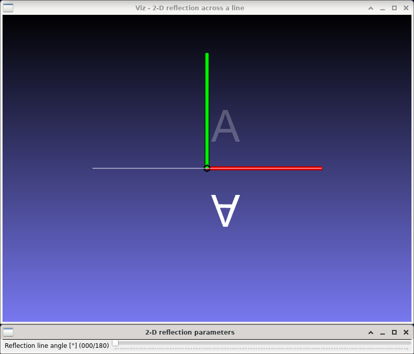
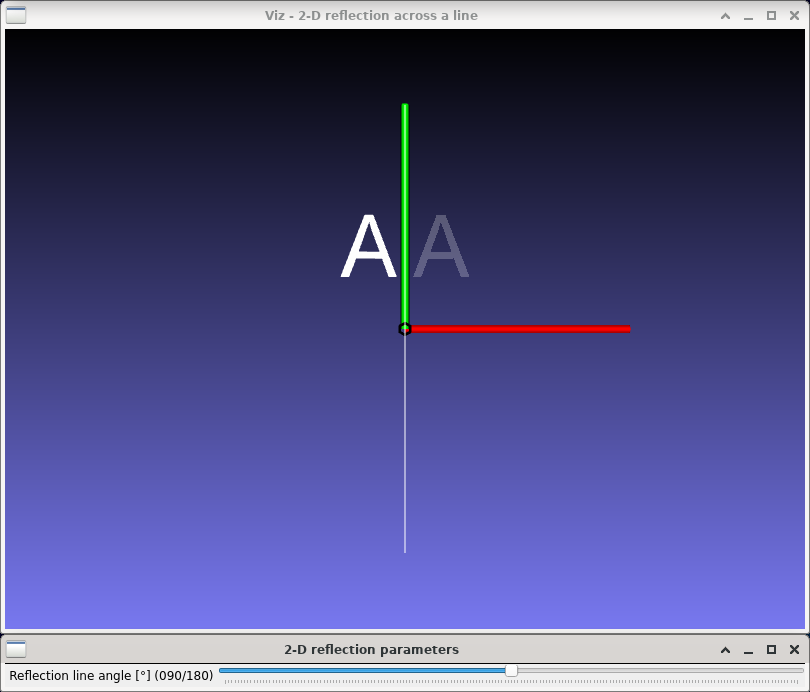

2-D reflection
==============

**Short description**: Illustration of 2-D reflection across a line (Illustrates reflection in two dimensions)

**Author**: Andreas Unterweger

**Status**: Complete

Overview
--------

Reflecting a point (illustrated by an arrow in the *2-D reflection across a line* window) across a line is a building block for more complex affine coordinate transformations. Objects, e.g., a whole letter, can be reflected by reflecting all the points they consist of individually.

Usage
-----

Change the angle between the reflection line and the X axis (see parameters below) to see the position of the reflected letter A (white) change compared to the original letter's (semi-transparent). Observe that the distance between any point of the original letter and the reflection line is the same as the distance between the reflection line and the corresponding reflected point, given that the distances are measured orthogonal to the reflection line.

Available actions
-----------------

None

Interactive parameters
----------------------

* **Reflection line angle** (track bar in the *2-D reflection parameters* window): Allows changing the angle between the reflection line and the X axis between 0 and 180 degrees.

Program parameters
------------------

None

Hard-coded parameters
---------------------

* `letter_size` (local to `reflection_data`): Width and height of the displayed letter in relative coordinates.
* `text` (local to `reflection_data::AddObjects`): Letter(s) to be rendered.

Known issues
------------

None

Missing features
----------------

None

License
-------

This demonstration and its documentation (this document) are provided under the 3-Clause BSD License (see [`LICENSE`](../LICENSE) file in the parent folder for details). Please provide appropriate attribution if you use any part of this demonstration or its documentation.