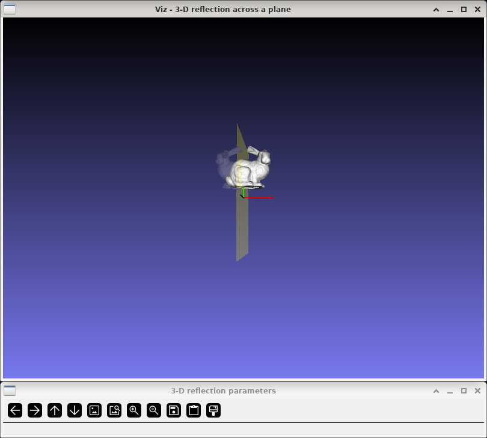
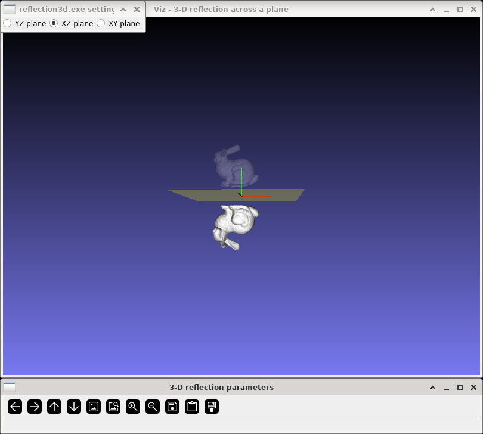

3-D reflection
==============

**Short description**: Illustration of 3-D reflection across a plane (Illustrates reflection in three dimensions)

**Author**: Andreas Unterweger

**Status**: Near-complete (nice-to-have features missing)

Overview
--------

Reflecting a point (illustrated by an arrow in the *3-D reflection across a plane* window) across a plane is a building block for more complex affine coordinate transformations. Objects, e.g., a 3-D model, can be reflected by reflecting all the points they consist of individually.

Usage
-----

Change the reflection plane (see parameters below) to see the position of the reflected 3-D model (white) change compared to the original 3-D model (semi-transparent). Observe that the distance between any point of the original model and the reflection plane (yellow, semi-transparent) is the same as the distance between the reflection plane and the corresponding reflected point, given that the distances are measured orthogonal to the reflection plane.

Available actions
-----------------

None

Interactive parameters
----------------------

* **Reflection plane** (radio buttons): Allows switching between reflecting at the YZ plane, the XZ plane and the XY plane.

Program parameters
------------------

None

Hard-coded parameters
---------------------

* `cone_length` (local to `scaling_data`): Height of the displayed cone in relative coordinates.
* `cone_radius` (local to `scaling_data`): Radius of the displayed cone in relative coordinates.

Known issues
------------

None

Missing features
----------------

* **Automatic coordinate system size adjustment**: The size of the coordinate axes does not depend on the size of the loaded model, but on the hard-coded size of the cone.

License
-------

This demonstration and its documentation (this document) are provided under the 3-Clause BSD License (see [`LICENSE`](../LICENSE) file in the parent folder for details). Please provide appropriate attribution if you use any part of this demonstration or its documentation.