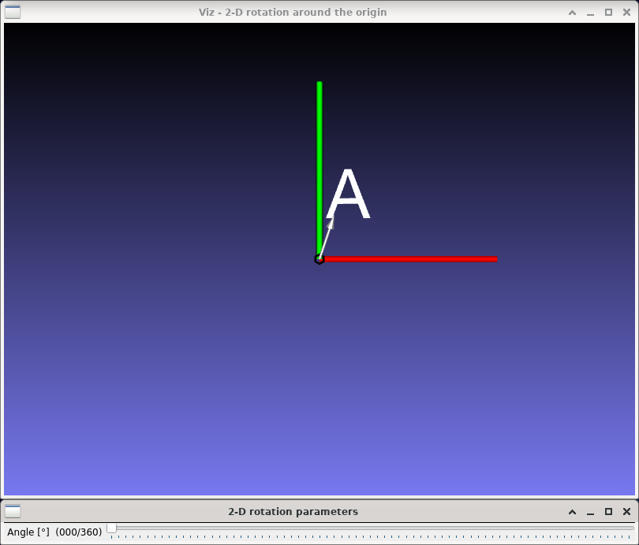
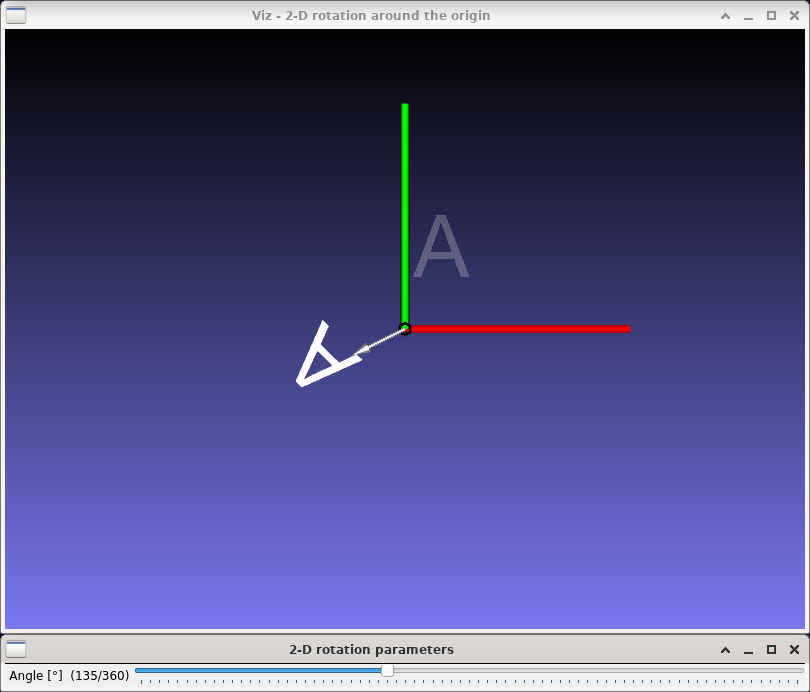

2-D rotation
============

**Short description**: Illustration of 2-D rotation around the origin (Illustrates rotation in two dimensions)

**Author**: Andreas Unterweger

**Status**: Complete

Overview
--------

Rotating a point (illustrated by an arrow in the *2-D rotation around the origin* window) around the origin is a building block for more complex affine coordinate transformations. Objects, e.g., a whole letter, can be rotated by rotating all the points they consist of individually.

Usage
-----

Change the angle of rotation (see parameters below) to see the position of the rotated letter A (white) change compared to the original letter's (semi-transparent). Observe that the distance between each point of the letter and the origin of the coordinate system (where the red and blue lines meet) does not change.

Available actions
-----------------

None

Interactive parameters
----------------------

* **Angle** (track bar in the *2-D rotation parameters* window): Allows changing the angle of rotation between 0 and 360 degrees.

Program parameters
------------------

None

Hard-coded parameters
---------------------

* `letter_size` (local to `rotation_data`): Width and height of the displayed letter in relative coordinates.
* `text` (local to `rotation_data::AddObjects`): Letter(s) to be rendered.

Known issues
------------

None

Missing features
----------------

None

License
-------

This demonstration and its documentation (this document) are provided under the 3-Clause BSD License (see [`LICENSE`](../LICENSE) file in the parent folder for details). Please provide appropriate attribution if you use any part of this demonstration or its documentation.