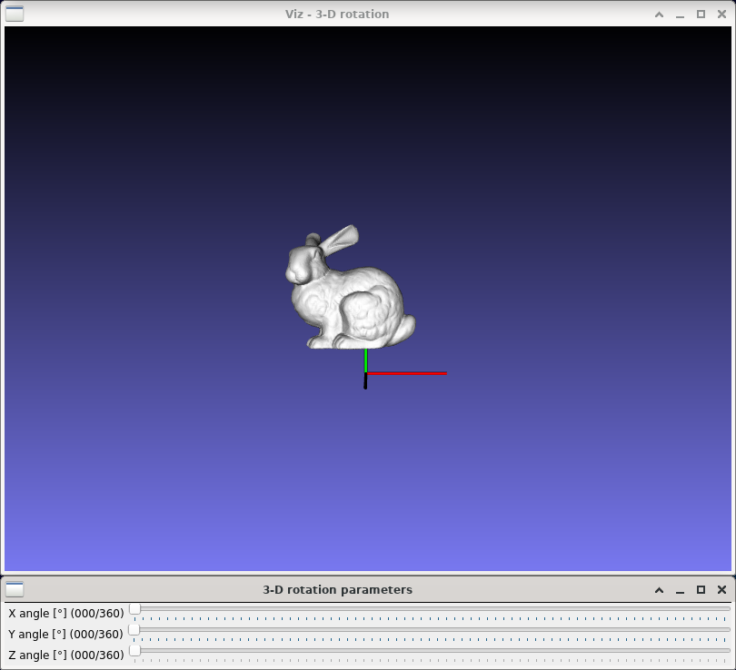
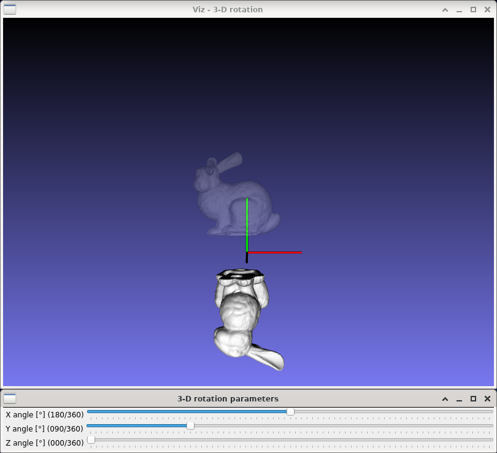

3-D rotation
============

**Short description**: Illustration of 3-D rotation around an axis (Illustrates rotation in three dimensions)

**Author**: Andreas Unterweger

**Status**: Near-complete (nice-to-have features missing)

Overview
--------

Rotating a point or collection of points around one of the coordinate axes is a building block for more complex affine coordinate transformations. Objects, e.g., a 3-D model of a bunny (*3-D rotation* window), can be rotated by rotating all the points they consist of individually.

Usage
-----

Change the angle of rotation around one axis (see parameters below) to see the position of the rotated bunny (white) change compared to the original's (semi-transparent). Observe that the distance between each point of the bunny and the axis of rotation does not change. Rotating around one axis and then another is equivalent to performing one (more complex) affine transformation which is composed of the two individual rotations.

Available actions
-----------------

None

Interactive parameters
----------------------

* **X angle** (track bar in the *3-D rotation parameters* window): Allows changing the angle of rotation around the X axis (red) between 0 and 360 degrees.
* **Y angle** (track bar in the *3-D rotation parameters* window): Allows changing the angle of rotation around the Y axis (green) between 0 and 360 degrees.
* **Z angle** (track bar in the *3-D rotation parameters* window): Allows changing the angle of rotation around the Z axis (blue) between 0 and 360 degrees.

Program parameters
------------------

* **3-D model** (optional): File path of the PLY model to be rotated. If no path is specified, a 3-D cone (see parameters below) will be created instead.

Hard-coded parameters
---------------------

* `cone_length` (local to `rotation_data`): Height of the displayed cone in relative coordinates.
* `cone_radius` (local to `rotation_data`): Radius of the displayed cone in relative coordinates.

Known issues
------------

None

Missing features
----------------

* **Automatic coordinate system size adjustment**: The size of the coordinate axes does not depend on the size of the loaded model, but on the hard-coded size of the cone.

License
-------

This demonstration and its documentation (this document) are provided under the 3-Clause BSD License (see [`LICENSE`](../LICENSE) file in the parent folder for details). Please provide appropriate attribution if you use any part of this demonstration or its documentation.