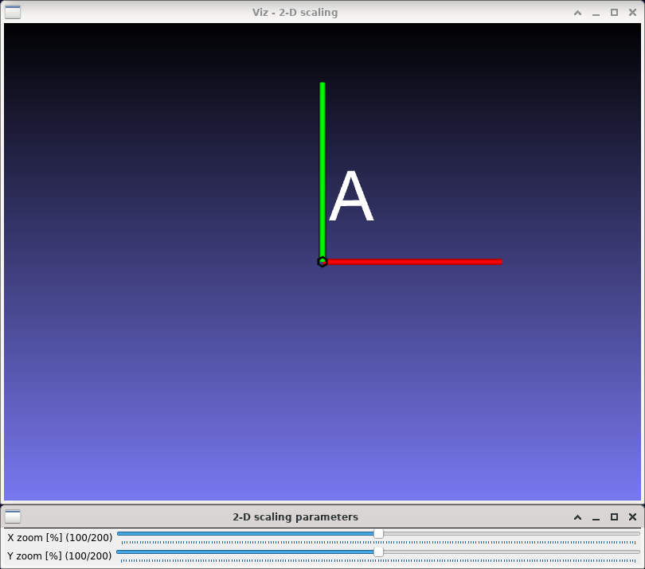
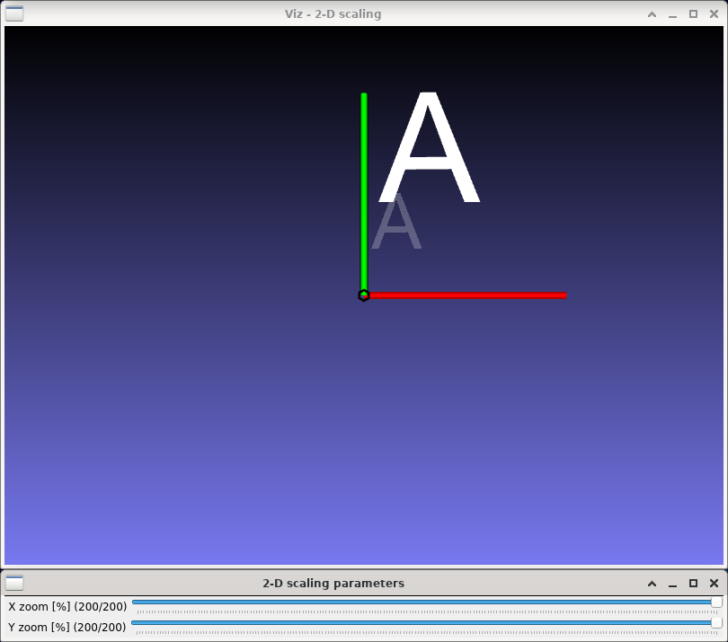

2-D scaling
===========

**Short description**: Illustration of 2-D scaling (Illustrates scaling in two dimensions)

**Author**: Andreas Unterweger

**Status**: Near-complete (non-crucial external bugs unfixed)

Overview
--------

Scaling a point by multiplying its coordinates by a factor is one of the simplest affine coordinate transformations. Objects, e.g., a whole letter (window *2-D scaling*), can be scaled by scaling all the points they consist of individually.

Usage
-----

Change the zoom value (see parameters below) to see the position and size of the scaled letter A (white) change compared to the original letter's (semi-transparent grey). Observe that the distance between each point of the letter and the origin of the coordinate system (where the red and blue lines meet) becomes a multiple of its original distance. The relative change is expressed by the zoom value. Using identical zoom values for both coordinates (X and Y) is referred to as isotropic scaling, which preserves the relative proportions of the letter. In contrast, using different zoom values for each coordinate is referred to as anisotropic scaling, which changes the aspect ratio, i.e., squeezes the letter.

Available actions
-----------------

None

Interactive parameters
----------------------

* **X zoom** (track bar in the *2-D scaling parameters* window): Allows changing the scaling factor for the X coordinate between 0 and 200%.
* **Y zoom** (track bar in the *2-D scaling parameters* window): Allows changing the scaling factor for the Y coordinate between 0 and 200%.

Program parameters
------------------

None

Hard-coded parameters
---------------------

* `letter_size`: Width and height of the displayed letter in relative coordinates.

Known issues
------------

* **Crash on exit** (*OpenCV* or *VTK* bug): The demonstration crashes with a segmentation fault on exit, i.e., when both windows are closed (see [*OpenCV* issue #9390](https://github.com/opencv/opencv/issues/9390)).

Missing features
----------------

None

License
-------

This demonstration and its documentation (this document) are provided under the 3-Clause BSD License (see [`LICENSE`](../LICENSE) file in the parent folder for details). Please provide appropriate attribution if you use any part of this demonstration or its documentation.