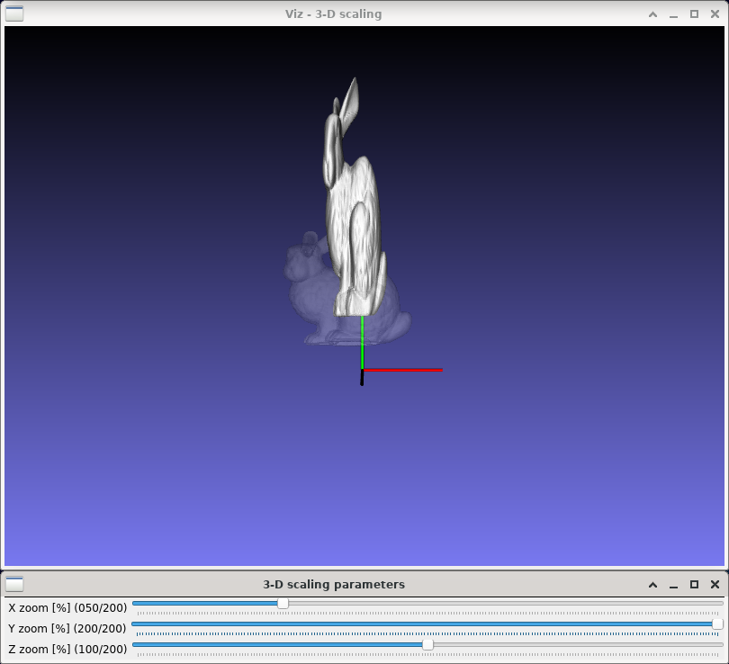

3-D scaling
===========

**Short description**: Illustration of 3-D scaling (Illustrates scaling in three dimensions)

**Author**: Andreas Unterweger

**Status**: Near-complete (nice-to-have features missing)

Overview
--------

Scaling a point by multiplying its coordinates by a factor is one of the simplest affine coordinate transformations. Objects, e.g., a 3-D model of a bunny (window *3-D scaling*), can be scaled by scaling all the points they consist of individually.

Usage
-----

Change the zoom value (see parameters below) to see the position and size of the scaled bunny (white) change compared to the original's (semi-transparent). Observe that the distance between each point of the bunny and the origin of the coordinate system (where the red and green lines meet) becomes a multiple of its original distance. The relative change is expressed by the zoom value. Using identical zoom values for all three coordinates (X, Y and Z) is referred to as isotropic scaling, which preserves the relative proportions of the bunny. In contrast, using different zoom values for each coordinate is referred to as anisotropic scaling, which changes the aspect ratio, i.e., squeezes the bunny.

Available actions
-----------------

None

Interactive parameters
----------------------

* **X zoom** (track bar in the *3-D scaling parameters* window): Allows changing scaling factor for the X coordinate between 0 and 200%.
* **Y zoom** (track bar in the *3-D scaling parameters* window): Allows changing scaling factor for the Y coordinate between 0 and 200%.
* **Z zoom** (track bar in the *3-D scaling parameters* window): Allows changing scaling factor for the Z coordinate between 0 and 200%.

Program parameters
------------------

* **3-D model** (optional): File path of the PLY model to be scaled. If no path is specified, a 3-D cone (see parameters below) will be created instead.

Hard-coded parameters
---------------------

* `cone_length` (local to `scaling_data`): Height of the displayed cone in relative coordinates.
* `cone_radius` (local to `scaling_data`): Radius of the displayed cone in relative coordinates.

Known issues
------------

None

Missing features
----------------

* **Automatic coordinate system size adjustment**: The size of the coordinate axes does not depend on the size of the loaded model, but on the hard-coded size of the cone.

License
-------

This demonstration and its documentation (this document) are provided under the 3-Clause BSD License (see [`LICENSE`](../LICENSE) file in the parent folder for details). Please provide appropriate attribution if you use any part of this demonstration or its documentation.