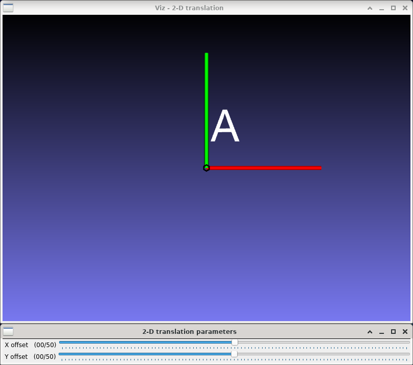

2-D translation
===============

**Short description**: Illustration of 2-D translation (Illustrates translation in two dimensions)

**Author**: Andreas Unterweger

**Status**: Complete

Overview
--------

Moving a point through translation is the only elementary affine tranformation which requires homogeneous coordinates. Objects, e.g., a whole letter (window *2-D translation*), can be moved by moving all the points they consist of individually.

Usage
-----

Change the offset (see parameters below) to see the position of the letter A (white) change compared to the original letter's (semi-transparent). Observe that the distance by which the letter is moved is absolute, i.e., it does not depend on the original position of the letter. The X and Y offsets can be changed independently of one another.

Available actions
-----------------

None

Interactive parameters
----------------------

* **X offset** (track bar in the *2-D translation parameters* window): Allows changing the translation parameter along the X direction between -50 and 50 in relative coordinates.
* **Y offset** (track bar in the *2-D translation parameters* window): Allows changing the translation parameter along the Y direction between -50 and 50 in relative coordinates.

Program parameters
------------------

None

Hard-coded parameters
---------------------

* `letter_size` (local to `translation_data`): Width and height of the displayed letter in relative coordinates.
* `text` (local to `translation_data::AddObjects`): Letter(s) to be rendered.

Known issues
------------

None

Missing features
----------------

None

License
-------

This demonstration and its documentation (this document) are provided under the 3-Clause BSD License (see [`LICENSE`](../LICENSE) file in the parent folder for details). Please provide appropriate attribution if you use any part of this demonstration or its documentation.