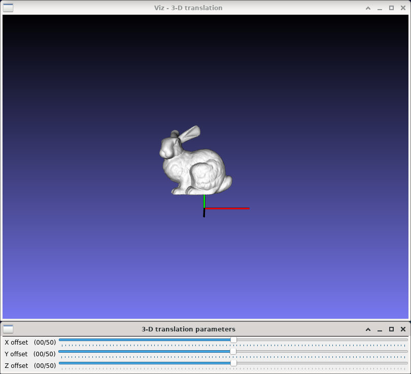

3-D translation
===============

**Short description**: Illustration of 3-D translation (Illustrates translation in three dimensions)

**Author**: Andreas Unterweger

**Status**: Near-complete (nice-to-have features missing)

Overview
--------

Moving a point through translation is the only affine tranformation which requires homogeneous coordinates. Objects, e.g., a 3-D model of a bunny (window *3-D translation*), can be moved by moving all the points they consist of individually.

Usage
-----

Change the offset (see parameters below) to see the position of the bunny (white) change compared to the original's (semi-transparent grey). Observe that the distance by which the bunny is moved is absolute, i.e., it does not depend on the original position of the bunny. The X, Y and Z offsets can be changed independently of one another.

Available actions
-----------------

None

Interactive parameters
----------------------

* **X offset** (track bar in the *3-D translation parameters* window): Allows changing the translation parameter along the X direction between -50 and 50 in relative coordinates.
* **Y offset** (track bar in the *3-D translation parameters* window): Allows changing the translation parameter along the Y direction between -50 and 50 in relative coordinates.
* **Z offset** (track bar in the *3-D translation parameters* window): Allows changing the translation parameter along the Z direction between -50 and 50 in relative coordinates.

Program parameters
------------------

* **3-D model** (optional): File path of the PLY model to be moved. If no path is specified, a 3-D cone (see parameters below) will be created instead.

Hard-coded parameters
---------------------

* `cone_length`: Height of the displayed cone in relative coordinates.
* `cone_radius`: Radius of the displayed cone in relative coordinates.

Known issues
------------

None

Missing features
----------------

* **Automatic coordinate system size adjustment**: The size of the coordinate axes does not depend on the size of the loaded model, but on the hard-coded size of the cone.

License
-------

This demonstration and its documentation (this document) are provided under the 3-Clause BSD License (see [`LICENSE`](../LICENSE) file in the parent folder for details). Please provide appropriate attribution if you use any part of this demonstration or its documentation.