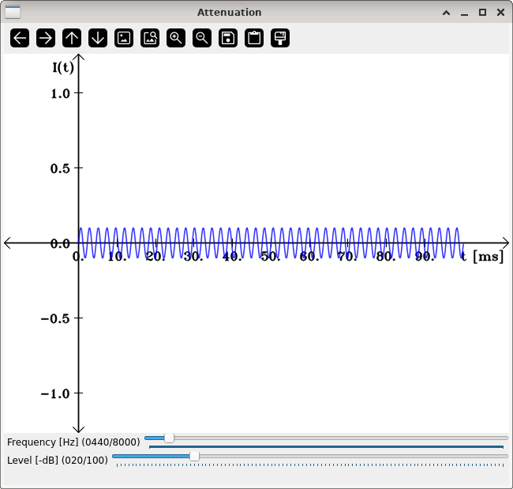

Frequency sensitivity
=====================

**Short description**: Illustration of frequency-dependent intensity sensitivity (Illustrates how intensities are perceived differently at different frequencies)

**Author**: Andreas Unterweger

**Status**: Complete

Overview
--------

The sensitivity of humans to acoustic signals depends on the signal frequency, i.e., equally intense sinusodial tones (in terms of sound pressure) are not perceived as equally loud when they differ in frequency. Thus, the loudness of a signal is not reflected in a visualization of the signal intensity over time (blue line in the *Attenuation* window).

Usage
-----

Change the frequency (see parameters below) of the tone to hear the perceived loudness change despite the sound level remaining constant. Similarly, observe that a sound level which is barely audible for one frequency might is either clearly noteable or appear mute for another. This can be double-checked by actually muting the signal.

Available actions
-----------------

None

Interactive parameters
----------------------

* **Frequency** (track bar in the *Attenuation* window): Allows changing the frequency of the sinusodial tone that is played back.
* **Level** (track bar in the *Attenuation* window): Allows changing the intensity (amplitude) of the sinusodial tone that is played back. The intensitiy is specified as a level in (negative) decibel.
* **Mute** (check box): Allows stopping and resuming playback, when unchecked and checked, respectively.

Program parameters
------------------

None

Hard-coded parameters
---------------------

* `default_frequency` (local to `audio_data`): Initial signal frequency in Hertz when the program is started. *Note: This frequency must be smaller than or equal to `max_frequency`.*
* `max_frequency` (local to `audio_data`): Maximum frequency in Hertz allowed to be configured for playback. *Note: The actual maximum frequency may be limited by the sound card, the driver and/or the speakers.*
* `default_level` (local to `audio_data`): Initial amplitude of the sinusodial tone in decibel when the program is started. *Note: This amplitude must be smaller than or equal to `max_level`.*
* `max_level` (local to `audio_data`): Maximum amplitude of the sinusodial tone in decibel allowed to be configured for playback. *Note: The actual maximum frequency is limited by the specified `audio_type` (see below).*
* `audio_type` (local to `audio_data`): Data type used for audio samples during generation and playback. 8-bit, 16-bit and 32-bit data types are supported.

Known issues
------------

None.

Missing features
----------------

None

License
-------

This demonstration and its documentation (this document) are provided under the 3-Clause BSD License (see [`LICENSE`](../LICENSE) file in the parent folder for details). Please provide appropriate attribution if you use any part of this demonstration or its documentation.
