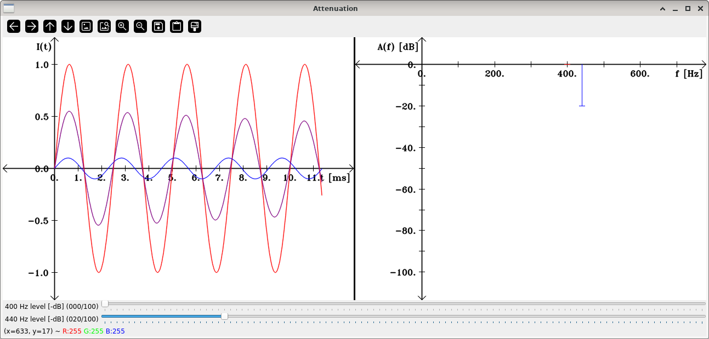

Frequency masking
=================

**Short description**: Illustration of frequency masking (Illustrates frequency masking at different intensities)

**Author**: Andreas Unterweger

**Status**: Complete

Overview
--------

When two acoustic signals (red and blue lines in the left part of the *Attenuation* window) with similar frequencies (illustrated in the right half) and sufficiently different intensities (in terms of sound pressure) are played back simultaneously, humans perceive only the more intense one instead of the combined signal (purple line). This effect is referred to as masking. Its strength mainly depends on the frequencies and the differences in intensity.

*Note: The combined signal is not the sum, but the average of the two signals. This avoids clipping.*

Usage
-----

Change the intensity (see parameters below) of one of the two sinusodial tones until it becomes inaudible, i.e., only the remaining sinusodial tone can be heard. Observe that the point of transition between audible and inaudible is not at the lowest possible intensity. Playback can be temporarily halted to allow for pauses.

Available actions
-----------------

None

Interactive parameters
----------------------

* **First frequency level** (track bar in the *Attenuation* window): Allows changing the intensity (amplitude) of the first sinusodial tone that is played back. The intensitiy is specified as a level in (negative) decibel.
* **Second frequency level** (track bar in the *Attenuation* window): Allows changing the intensity (amplitude) of the second sinusodial tone that is played back. The intensitiy is specified as a level in (negative) decibel.
* **Mute** (check box): Allows stopping and resuming playback, when unchecked and checked, respectively.

Program parameters
------------------

None

Hard-coded parameters
---------------------

* `frequencies`: Frequencies of the two sinusodial tones in Hertz. *Note: This array must contain exactly two frequencies, the first of which must be smaller than the second.*
* `audio_type`: Data type used for audio samples during generation and playback. 8-bit, 16-bit and 32-bit data types are supported.

Known issues
------------

None.

Missing features
----------------

None

License
-------

This demonstration and its documentation (this document) are provided under the 3-Clause BSD License (see [`LICENSE`](../LICENSE) file in the parent folder for details). Please provide appropriate attribution if you use any part of this demonstration or its documentation.
