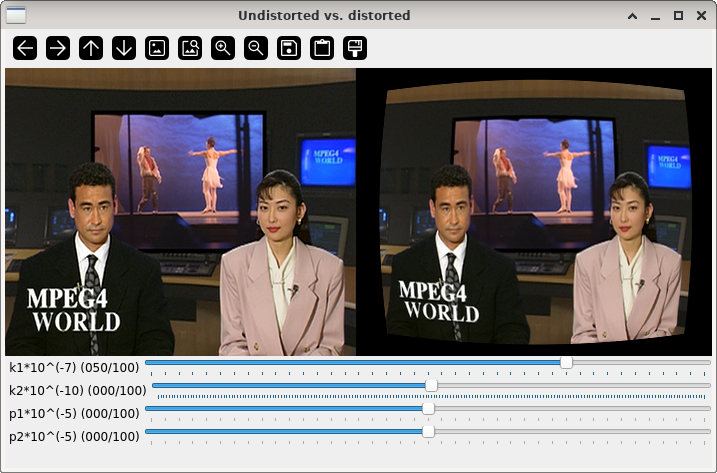

Non-linear distortion
=====================

**Short description**: Illustration of non-linear lense distortion (Illustrates the effect of the distortion vector on a camera image)

**Author**: Andreas Unterweger

**Status**: Work in progress (internal bugs unfixed and features missing)

Overview
--------

Camera lenses cause non-linear distortions in the captured image. Comparing such a distorted image (right part of the *Undistorted vs. distorted* window) with that of an ideal pinhole camera (left) makes the distortions visible. For simplicity, distortions are often modeled as [polynomials with distortion coefficients](https://docs.opencv.org/3.4.0/d9/d0c/group__calib3d.html) to describe radial and tangential distortions.

Usage
-----

Change the distortion coefficients (see parameters below) to see the distorted image change. Observe that negative distortion coefficients change the type of distortion.

Available actions
-----------------

None

Interactive parameters
----------------------

* **k1** (track bar in the *Undistorted vs. distorted* window): Allows changing the quadratic radial distortion coefficient between -100 (for negative coefficients) and 100 with a scaling factor of 10^(-7).
* **k2** (track bar in the *Undistorted vs. distorted* window): Allows changing the quartic (bi-quadratic) radial distortion coefficient between -100 (for negative coefficients) and 100 with a scaling factor of 10^(-10).
* **p1** (track bar in the *Undistorted vs. distorted* window): Allows changing the quadratic tangential distortion coefficient between -100 (for negative coefficients) and 100 with a scaling factor of 10^(-5).
* **p2** (track bar in the *Undistorted vs. distorted* window): Allows changing the linear tangential distortion coefficient between -100 (for negative coefficients) and 100 with a scaling factor of 10^(-5).
* **Negative distortion coefficients** (check box): Allows setting all distortion coefficients to their negative counterparts, e.g., 10 to -10, if checked.

Program parameters
------------------

* **Input image**: File path of the image to be distorted.

Hard-coded parameters
---------------------

None. *Note: The scaling factors for the coefficients are hard-coded, but the range of meaningful values is very limited. Thus, it is not recommended to change the scaling factors explicitly.*

Known issues
------------

* **Use of `undistort`**: The `undistort` function is used instead of a `distort` function to calculate the distorted image, potentially showing incorrect results. There is a `distortPoints` function in *OpenCV's* `fisheye` namespace, but its use is unclear (see [*OpenCV* issue #10947](https://github.com/opencv/opencv/issues/10947)).

Missing features
----------------

* **Scaling factors are not displayed**: The naming convention of the distortion coefficients follows that of [*OpenCV*'s model parameters](https://docs.opencv.org/3.4.0/d9/d0c/group__calib3d.html) and does not explicitly show the scaling factors.

License
-------

This demonstration and its documentation (this document) are provided under the 3-Clause BSD License (see [`LICENSE`](../LICENSE) file in the parent folder for details). Please provide appropriate attribution if you use any part of this demonstration or its documentation.