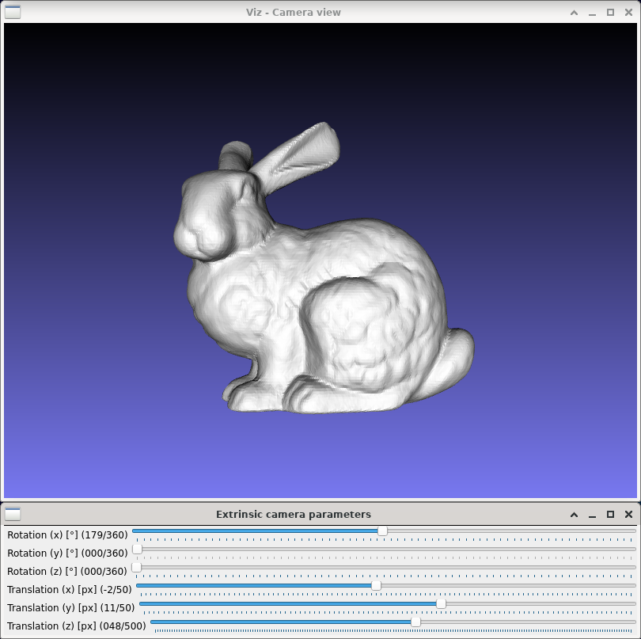

Pinhole camera extrinsics
=========================

**Short description**: Illustration of extrinsic camera parameters (Illustrates the effect of the extrinsic parameters of a pinhole camera)

**Author**: Andreas Unterweger

**Status**: Near-complete (non-crucial external bugs unfixed)

Overview
--------

The extrinsic parameters of a pinhole camera impact the image that it captures (window *Camera view*). The two sets of parameters are [rotation and translation](https://docs.opencv.org/4.6.0/d9/d0c/group__calib3d.html) relative to a chosen reference point. Both parameter sets are three-dimensional due to the three spatial dimensions.

Usage
-----

Change the rotation and translation of the camera (see parameters below) to see the projection of the 3-D model of a bunny change. Observe that negative Z translation values move the object behind the camera, which makes the bunny disappear from the image.

Available actions
-----------------

None

Interactive parameters
----------------------

* **Rotation (x)** (track bar in the *Extrinsic camera parameters* window): Allows changing the rotation around the X axis in degrees.
* **Rotation (y)** (track bar in the *Extrinsic camera parameters* window): Allows changing the rotation around the Y axis in degrees.
* **Rotation (z)** (track bar in the *Extrinsic camera parameters* window): Allows changing the rotation around the Z axis in degrees.
* **Translation (x)** (track bar in the *Extrinsic camera parameters* window): Allows changing the X offset relative to the reference point in pixels.
* **Translation (y)** (track bar in the *Extrinsic camera parameters* window): Allows changing the Y offset relative to the reference point in pixels.
* **Translation (z)** (track bar in the *Extrinsic camera parameters* window): Allows changing the Z offset relative to the reference point in pixels.

Program parameters
------------------

* **3-D model** (optional): File path of the PLY model to be displayed. If no path is specified, a 3-D cone (see parameters below) will be created instead.

Hard-coded parameters
---------------------

* `parameter_accuracy` (local to `extrinsics_data`): Granularity of parameters in relative coordinates. The default value of 0.01 represents an accuracy of two decimal places after the decimal point.
* `cone_length` (local to `extrinsics_data::AddObjects`): Height of the displayed cone in relative coordinates.
* `cone_radius` (local to `extrinsics_data::AddObjects`): Radius of the displayed cone in relative coordinates.

Known issues
------------

* **Camera stuttering** (*OpenCV* bug): The camera stutters (and eventually shows nothing at all) when changing between parameter values (see [*OpenCV* issue #9388](https://github.com/opencv/opencv/issues/9388)).

Missing features
----------------

None

License
-------

This demonstration and its documentation (this document) are provided under the 3-Clause BSD License (see [`LICENSE`](../LICENSE) file in the parent folder for details). Please provide appropriate attribution if you use any part of this demonstration or its documentation.
