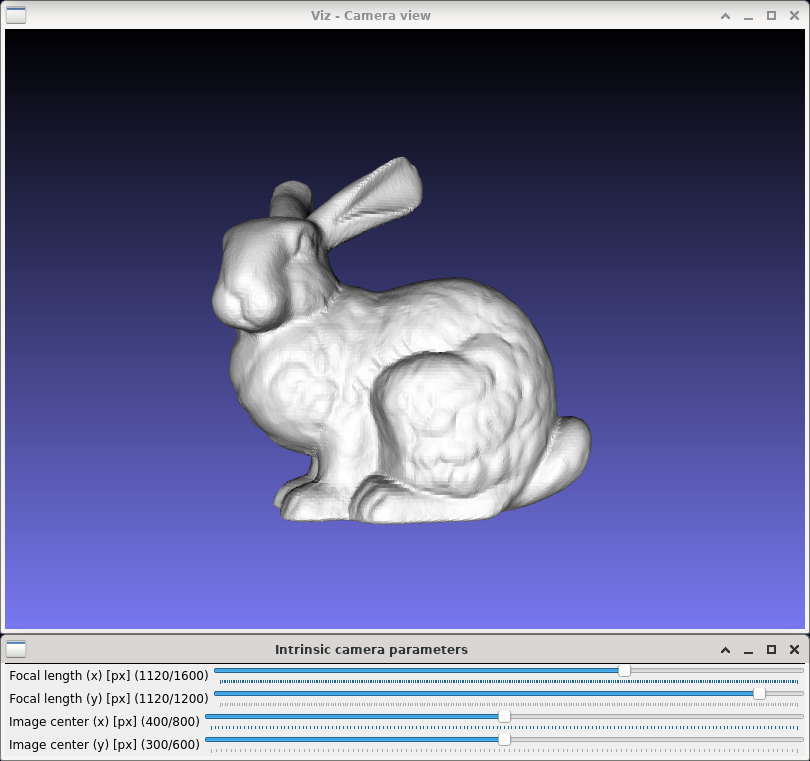

Pinhole camera intrinsics
=========================

**Short description**: Illustration of intrinsic camera parameters (Illustrates the effect of the intrinsic parameters of a pinhole camera)

**Author**: Andreas Unterweger

**Status**: Work in progress (features missing and external bugs unfixed)

Overview
--------

The intrinsic parameters of a pinhole camera impact the image that it captures (window *Camera view*). The two main parameters are the focal length and the principal point. Both are two-dimensional and can be [expressed in pixels](https://docs.opencv.org/3.4.0/d9/d0c/group__calib3d.html).

Usage
-----

Change the coordinates of the image center (see parameters below) to see the position of the cone on the projection change. Observe that changing the focal length changes the size of the projected cone. When the X and Y focal lengths differ from one another, non-square sensor pixels are simulated and the projected cone's aspect ratio changes.

Available actions
-----------------

None

Interactive parameters
----------------------

* **Focal length (x)** (track bar in the *Intrinsic camera parameters* window): Allows changing the focal length in pixels along the X direction.
* **Focal length (y)** (track bar in the *Intrinsic camera parameters* window): Allows changing the focal length in pixels along the Y direction.
* **Image center (x)** (track bar in the *Intrinsic camera parameters* window): Allows changing the X coordinate of the image center in pixels.
* **Image center (y)** (track bar in the *Intrinsic camera parameters* window): Allows changing the Y coordinate of the image center in pixels.

Program parameters
------------------

* **3-D model** (optional): File path of the PLY model to be displayed. If no path is specified, a 3-D cone (see parameters below) will be created instead.

Hard-coded parameters
---------------------

* `cone_length`: Height of the displayed cone in relative coordinates.
* `cone_radius` (local to `AddObjects`): Radius of the displayed cone in relative coordinates.

Known issues
------------

* **Stuttering** (*OpenCV* bug): Changing parameters yields a stuttering effect due to differences in every second re-rendering (see [*OpenCV* issue #9388](https://github.com/opencv/opencv/issues/9388)).
* **Crash on exit** (*OpenCV* or *VTK* bug): The demonstration crashes with a segmentation fault on exit, i.e., when both windows are closed (see [*OpenCV* issue #9390](https://github.com/opencv/opencv/issues/9390)).

Missing features
----------------

* **No meaningful maximum value for focal lengths**: The maximum displayed X and Y focal lengths are arbitrary.

License
-------

This demonstration and its documentation (this document) are provided under the 3-Clause BSD License (see [`LICENSE`](../LICENSE) file in the parent folder for details). Please provide appropriate attribution if you use any part of this demonstration or its documentation.
