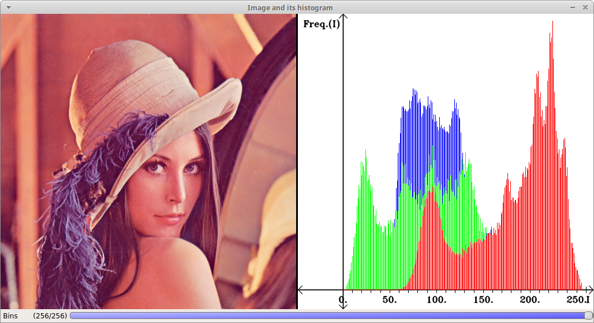
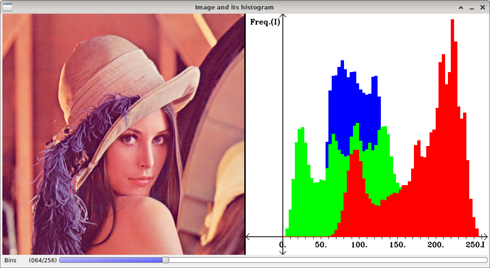

RGB image histograms
====================

**Short description**: Illustration of image histograms (Illustrates the different histograms of an RGB image)

**Author**: Andreas Unterweger

**Status**: Complete

Overview
--------

The channels of an RGB image (left in the *Image and its histogram* window) can be separated to calculate per-channel histograms (right). Each of the three histograms represents the frequency of brighness values in the red, green and blue channel, respectively. The number of histogram bins impacts how many intensities are grouped together, i.e., which values are combined for the frequency calculation.

Usage
-----

Change the number of bins (see parameters below) to see the frequency values in the histogram change due to the different grouping. Observe that the general shape of the histogram stays about the same, but details disappear when using a small number of bins. For the default program parameters, observe that the high frequency of bright-red intensities (high values in the red histogram) reflects the red-ish tone of the image.

Available actions
-----------------

None. *Note: See below for parameters to change.*

Interactive parameters
----------------------

* **Bins** (track bar in the *Image and its histogram* window): Allows changing the number of bins for calculating the histogram. The same number of bins is used for all histograms.

Program parameters
------------------

* **Input image**: File path of the image to calculate the histograms of.

Hard-coded parameters
---------------------

None

Known issues
------------

None

Missing features
----------------

None

License
-------

This demonstration and its documentation (this document) are provided under the 3-Clause BSD License (see [`LICENSE`](../LICENSE) file in the parent folder for details). Please provide appropriate attribution if you use any part of this demonstration or its documentation.
