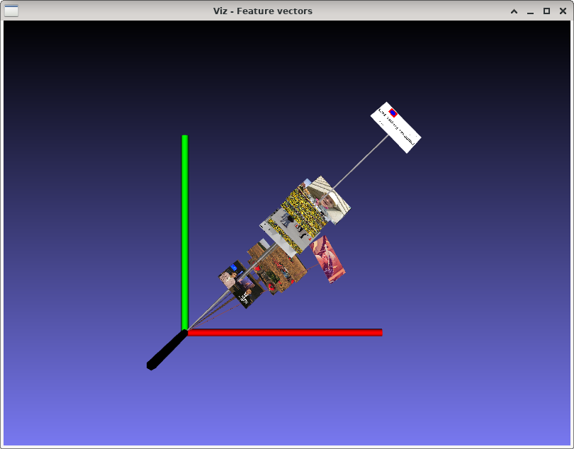
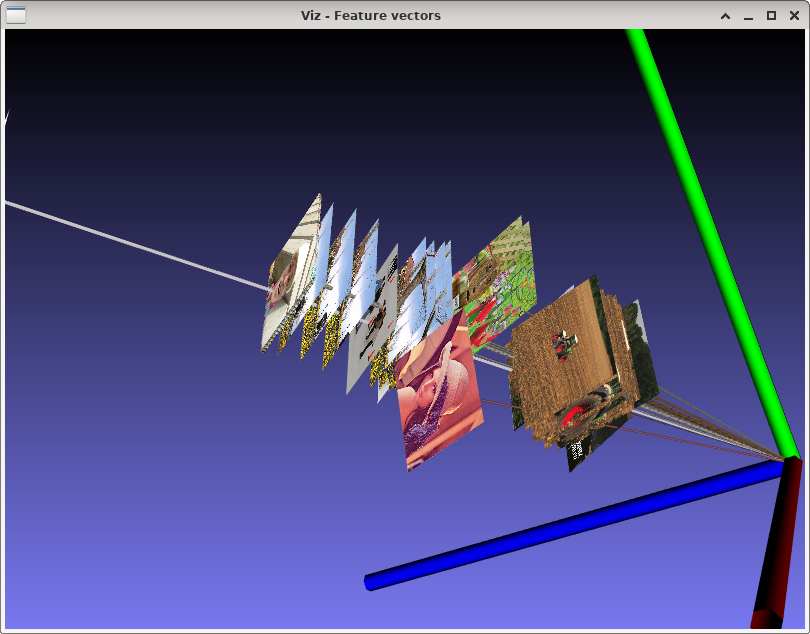

Mean RGB image features
=======================

**Short description**: Illustration of mean RGB feature vectors (Illustrates images and their feature vectors when using mean RGB features)

**Author**: Andreas Unterweger

**Status**: Near-complete (non-crucial features missing)

Overview
--------

The average red, green and blue intensity of an RGB image can be visualized by a three-dimensional vector (window *Feature vectors*). For multiple images, these vectors consisting of mean R, G and B values, can be used as features, e.g., to compute the similarity of two images and to find similar images.

Usage
-----

Zoom into the collection of feature vectors to see the images corresponding to each vector on top of them. Move the camera to change the perspective. Observe that images of similar color and brightness are closer to one another, while dissimilar images are farther apart.

Available actions
-----------------

None

Interactive parameters
----------------------

None. *Note: The camera position and zoom can be changed using the mouse.*

Program parameters
------------------

* **Input images** (one image per parameter): File path of the images to calculate mean RGB feature vectors of. *Note: At least one parameter (image) must be specified.*

Hard-coded parameters
---------------------

* `thumbnail_size` (local to `VisualizeImage`): Width and height of the images in the visualization in relative coordinates.

Known issues
------------

None

Missing features
----------------

* **Normalization**: There is no option to normalize the mean values to illustrate features that are independent of overall image brightness.

License
-------

This demonstration and its documentation (this document) are provided under the 3-Clause BSD License (see [`LICENSE`](../LICENSE) file in the parent folder for details). Please provide appropriate attribution if you use any part of this demonstration or its documentation.
