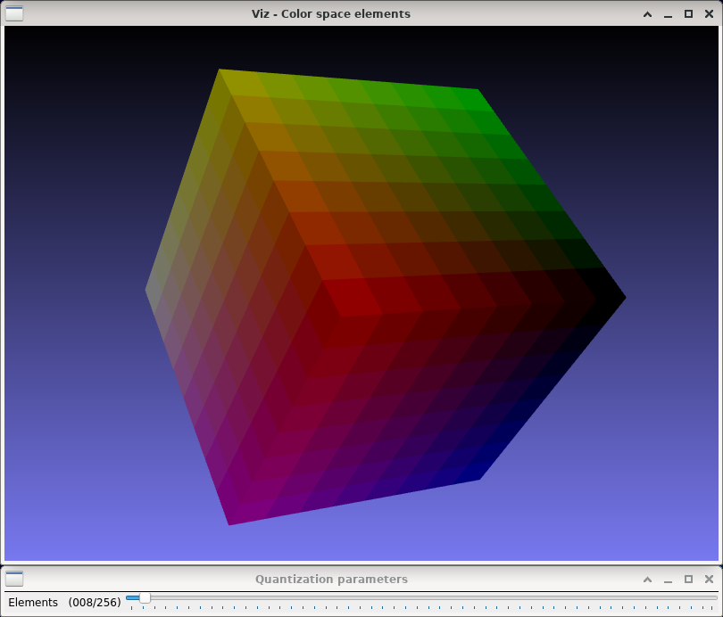

RGB color space quantization
============================

**Short description**: Illustration of color space quantization (Illustrates the effect of quantization on the RGB color space)

**Author**: Andreas Unterweger

**Status**: Work in progress (external and internal bugs unfixed)

Overview
--------

The RGB color space can be visualized as a three-dimensional cube consisting of smaller cuboid elements (window *Color space elements*). Each of the elements represents one color that can be mixed in the RGB color space. The R, G and B portions of each of the element are proportional to its position in space, with each spatial dimension representing one of the primary colors. The number of elements per spatial dimension determines the level of quantization of the visualized RGB color space.

Usage
-----

Change the number of elements (see parameters below) to see the quantized colors of the RGB color space change. Observe that a small number of elements only allows for mixing a small subset of possible colors, while the maximum number of elements corresponds to an 24-bit color space (8 bits per channel) without additional quantization.

Available actions
-----------------

None. *Note: See below for parameters to change.*

Interactive parameters
----------------------

* **Elements** (track bar in the *Color space elements* window): Allows changing the number of cuboid elements per dimension, i.e., number of possible values per color channel after quantization.

*Note: Additionally, the camera position and zoom can be changed using the mouse.*

Program parameters
------------------

None

Hard-coded parameters
---------------------

None

Known issues
------------

* **Window is white after changing the number of elements** (*OpenCV* or *VTK* bug): The visualization window does not show any content, but only an all-white surface until it is moved (see [*OpenCV* issue #9759](https://github.com/opencv/opencv/issues/9759)).
* **Crash on exit** (*OpenCV* or *VTK* bug): The demonstration crashes with a segmentation fault on exit, i.e., when both windows are closed (see [*OpenCV* issue #9390](https://github.com/opencv/opencv/issues/9390)).
* **Slow drawing speed**: Setting the number of elements to 5 or more results in significant delays for the initial rendering of the cube as well as for all subsequent renderings after rotating the cube by adjusting the camera.

Missing features
----------------

None

License
-------

This demonstration and its documentation (this document) are provided under the 3-Clause BSD License (see [`LICENSE`](../LICENSE) file in the parent folder for details). Please provide appropriate attribution if you use any part of this demonstration or its documentation.