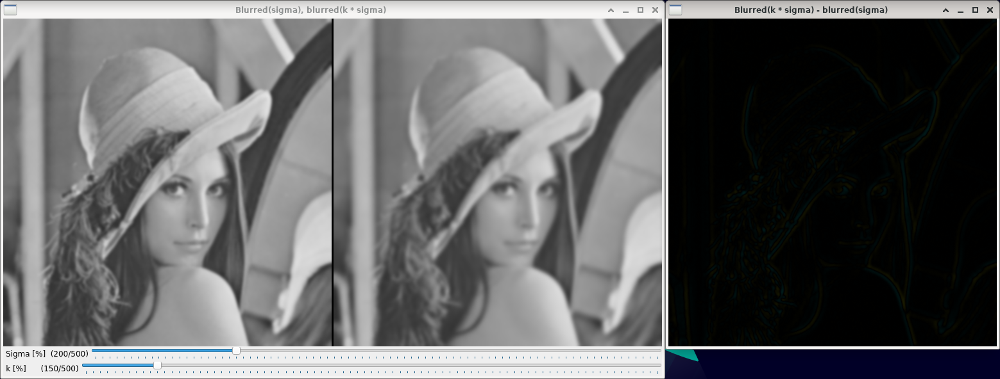
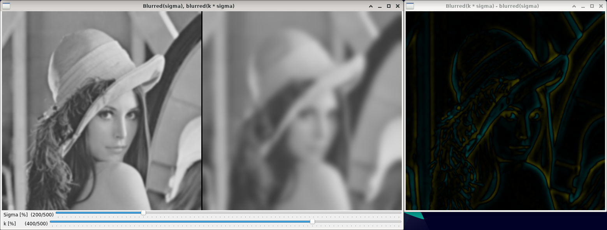

Difference of Gaussians
=======================

**Short description**: Illustration of DoG computation (Illustrates the effect of the differences in sigma for the DoG)

**Author**: Andreas Unterweger

**Status**: Complete

Overview
--------

In order to robustly find edges in images at multiple scales, the Difference of Gaussians (DoG) can be used. It is computed by subtracting a Gaussian-filtered image with a standard deviation of sigma (left in the *Blurred(sigma) vs. blurred(k\*sigma)* window) from the image filtered with a multiple (k) of sigma (right). The result of the subtraction, i.e., the difference image (window *Blurred(k\*sigma) - blurred(sigma)*), allows localizing edges for suitable choices of k.

*Note on residual visualizations: Yellow pixels indicate positive differences, teal pixels indicate negative differences. The brighter the color is, the larger the differences are in absolute terms. Black equals zero, i.e., no difference.*

Usage
-----

Change the value of k (see parameters below) to see the second filtered image (right) become more blurry due to the higher standard deviation. Observe that edges in the difference image become more clearly visible due to the larger difference between the two filtered images. Change the value of sigma to see the size of the detected edges in the DoG image change. Observe that not all edges are visible for any value of k.

Available actions
-----------------

None. *Note: See below for parameters to change.*

Interactive parameters
----------------------

* **Sigma** (track bar in the *Blurred(sigma) vs. blurred(k\*sigma)* window): Allows changing the standard deviation (in the X and Y direction) of the first Gaussian filter in percent.
* **k** (track bar in the *Blurred(sigma) vs. blurred(k\*sigma)* window): Allows changing the value of k in percent, which is multiplied with sigma (both, in the X and Y direction) to determine the standard deviation of the second Gaussian filter.

Program parameters
------------------

* **Input image**: File path of the image to perform the DoG operation on.

Hard-coded parameters
---------------------

* `max_sigma` (local to `ShowImages`): Maximum value of sigma allowed to be configured for the standard deviation.
* `max_k` (local to `ShowImages`): Maximum value of k allowed to be configured for the multiplier.

Known issues
------------

None

Missing features
----------------

None

License
-------

This demonstration and its documentation (this document) are provided under the 3-Clause BSD License (see [`LICENSE`](../LICENSE) file in the parent folder for details). Please provide appropriate attribution if you use any part of this demonstration or its documentation.