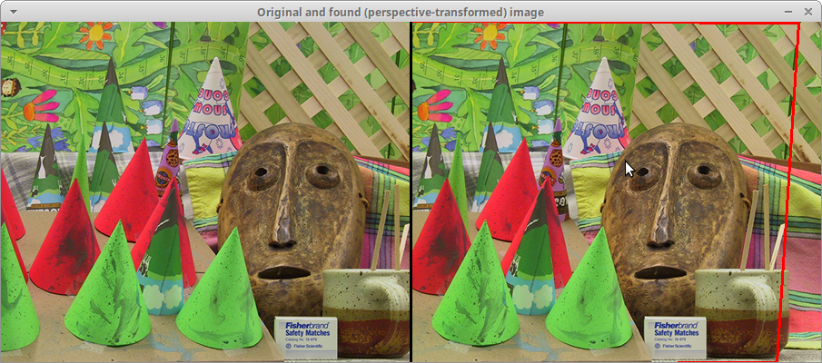
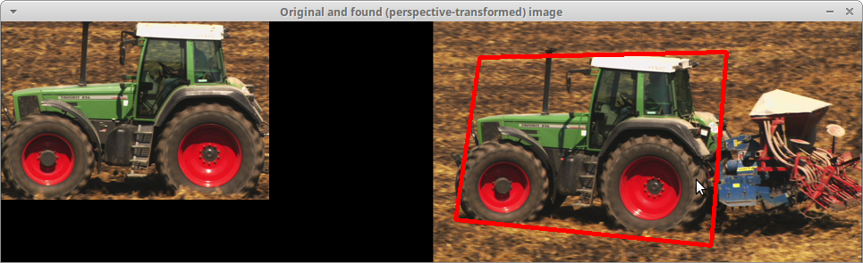

Matching for perspective transform
==================================

**Short description**: Illustration of SIFT matching for finding a perspective transform (Illustrates how to find an image with a perspective transform within another image)

**Author**: Andreas Unterweger

**Status**: Done

Overview
--------

One image (left in the *Images combined* window) can be found within another (right) even when the perspective is changed slightly. To do so, keypoints in both images are computed and matched to estimate a transform from the first to the second image. After applying this transform to the frame of the first image, it can be found in the second image (red deformed rectangle).

Usage
-----

Observe that the first image is, for the most part, contained within the second. The left-most portion is an exception. The slight change in perspective does not impact the matching, nor do occlusions like the one around the tip of the rightmost green cone. Note that the estimated perspective transform is not entirely correct due to the limitations of homography-based mapping on non-planar objects.

Available actions
-----------------

Press Q to quit. Use any other key to advance to the next frame. *Notes: Pressing any key in the last frame terminates the program.*

Interactive parameters
----------------------

None.

Program parameters
------------------

* **First image**: File path of the first image to find within the second.
* **Second image**: File path of the second image to find the first one in. This parameter can also specify the file path of a video consisting of multiple second images. If *-* is specified, a webcam is used.
* (optional) **Waiting time between images**: Time in ms to wait after each processed second image. The default value 0 denotes infinite waiting, which can be interrupted by a key press.

Hard-coded parameters
---------------------

* `line_width`: Width of the transformed image frame's lines in pixels.

Known issues
------------

None

Missing features
----------------

None

License
-------

This demonstration and its documentation (this document) are provided under the 3-Clause BSD License (see [`LICENSE`](../LICENSE) file in the parent folder for details). Please provide appropriate attribution if you use any part of this demonstration or its documentation.
