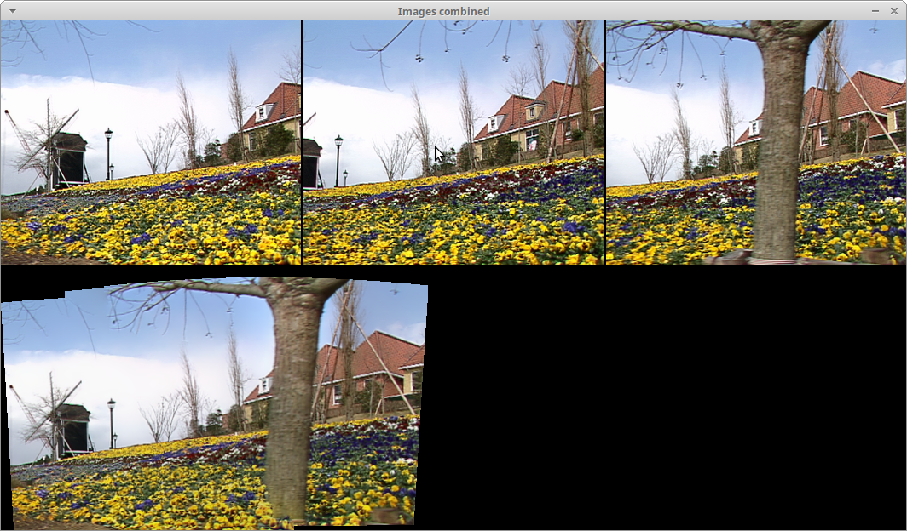

Panoramic image
===============

**Short description**: Illustration of panoramic images (Illustrates how a panoramic image can be created from multiple single images)

**Author**: Andreas Unterweger

**Status**: Done

Overview
--------

Multiple images (top in the *Images combined* window) can be merged into a panoramic image (bottom) under certain conditions. To do so, keypoints in both images are computed and matched to estimate transformations between the images. After compensating for these transformations, the images are stitched together. For this to work, the images need to have relatively small differences in perspective.

Usage
-----

Observe that both images are warped to fit together without overlapping. This forms a panoramic image. The errors around the bootom of the tree stems from the occlusions (missing pixel data) due to the differences in perspective between the images.

Available actions
-----------------

None

Interactive parameters
----------------------

None

Program parameters
------------------

* **First image**: File path of the first image.
* **Second image**: File path of the second image to be combined with the first.
* (optional) **Third image**: File path of the third image to be combined with the first two.
* ...

*Note: This program supports an arbitrary number of images (parameters).*

Hard-coded parameters
---------------------

None

Known issues
------------

None

Missing features
----------------

None

License
-------

This demonstration and its documentation (this document) are provided under the 3-Clause BSD License (see [`LICENSE`](../LICENSE) file in the parent folder for details). Please provide appropriate attribution if you use any part of this demonstration or its documentation.