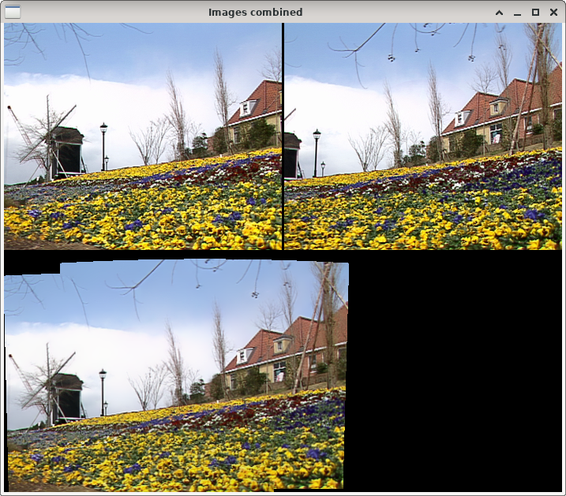

Panoramic image
===============

**Short description**: Illustration of panoramic images (Illustrates how a panoramic image can be created from SIFT keypoint matches)

**Author**: Andreas Unterweger

**Status**: Work in progress (features missing)

Overview
--------

Two images (top in the *First and second image combined* window) can be merged into a panoramic image (bottom) under certain conditions. To do so, the SIFT keypoints of both are matched and a corresponding homography is computed to warp the second image next to the first. For this to work, the two images need to have only small differences in perspective.

Usage
-----

Observe that the right image is warped so that it extends the left one. This forms a panoramic image. *Note: For the default program parameters, the black vertical bar between the two images stems from the source images. It is not an error introduced by the matching or warping processes.*

Available actions
-----------------

None

Interactive parameters
----------------------

None

Program parameters
------------------

* **First image**: File path of the left image.
* **Second image**: File path of the right (second) image to be combined with the first.

Hard-coded parameters
---------------------

None

Known issues
------------

None

Missing features
----------------

* **Support for multiple images**: There is no option to create a panoramic image out of more than two images. For example, for three images, the first and third image would have to be warped to the second on the left and right, respectively.

License
-------

This demonstration and its documentation (this document) are provided under the 3-Clause BSD License (see [`LICENSE`](../LICENSE) file in the parent folder for details). Please provide appropriate attribution if you use any part of this demonstration or its documentation.