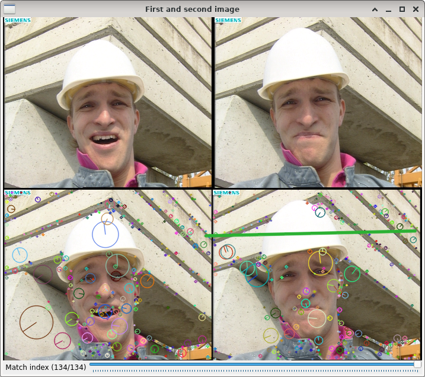
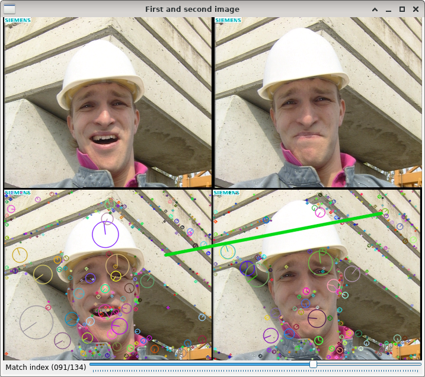

SIFT keypoint matching
======================

**Short description**: Illustration of SIFT keypoint matching (Illustrates how SIFT keypoints in two images can be matched)

**Author**: Andreas Unterweger

**Status**: Complete

Overview
--------

SIFT can be used to find points in two different images (top in the *First and second image* window) which are robust to several types transformations. These keypoints and their associated descriptors can be matched to find corresponding points in the two images. To achieve good performance, only close matches are retained in a filtering process.

Usage
-----

Change the match index (see parameters below) to visualize the corresponding points (connected by the colored line at the bottom of the *First and second image* window) one by one. Observe that not all matches are actually correct, even though they are considered to be close.

Available actions
-----------------

None. *Note: See below for parameters to change.*

Interactive parameters
----------------------

* **Match index** (track bar in the *First and second image* window): Allows changing the visualized match, i.e., the pair of supposedly-matching keypoints. The range of this index is bound by the number of filtered matches.

Program parameters
------------------

* **First image**: File path of the first image to detect keypoints in.
* **Second image**: File path of the second image to detect keypoints in.

Hard-coded parameters
---------------------

None

Known issues
------------

None

Missing features
----------------

None

License
-------

This demonstration and its documentation (this document) are provided under the 3-Clause BSD License (see [`LICENSE`](../LICENSE) file in the parent folder for details). Please provide appropriate attribution if you use any part of this demonstration or its documentation.