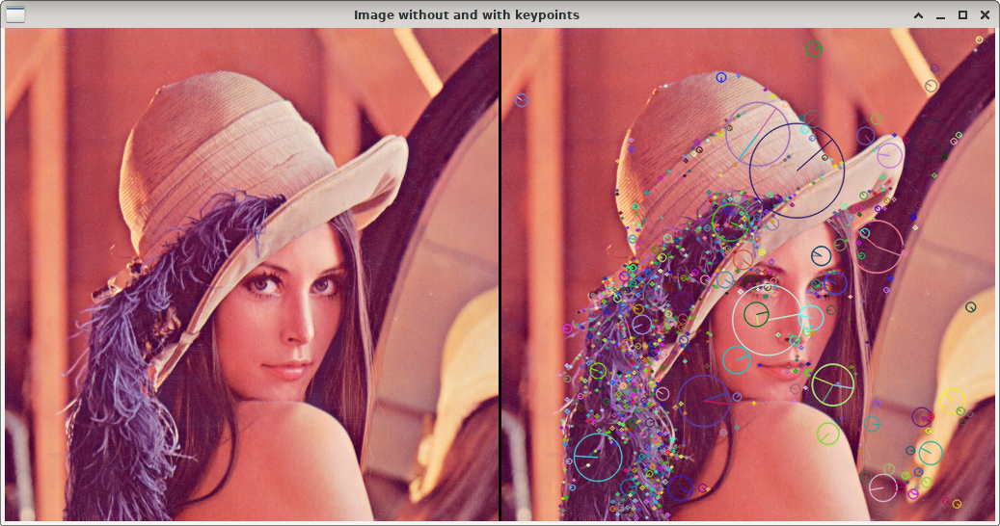

SIFT keypoints
==============

**Short description**: Illustration of SIFT keypoints (Illustrates the SIFT keypoints of an image)

**Author**: Andreas Unterweger

**Status**: Complete

Overview
--------

SIFT can be used to find points in an image (window *Image without and with keypoints*) which are robust to several types transformations. If the image was taken from a different distance or perspective, many of the same points would likely be found. The points are therefore referred to as keypoints.

Usage
-----

Keypoints are illustrated by circles of different colors. The radius of the circle illustrates the scale at which the keypoints are found, while the lines from the center to the border of the circle illustrate the dominant direction for rotation invariance. For the default program parameters, observe that SIFT finds prominent image features of different sizes, e.g., the right cheek with part of the nose (rose-colored circle) at a larger scale and several points along the edge of the hat at a smaller scale.

Available actions
-----------------

None

Interactive parameters
----------------------

None

Program parameters
------------------

* **Input image**: File path of the image to detect SIFT keypoints in.

Hard-coded parameters
---------------------

None

Known issues
------------

None

Missing features
----------------

None

License
-------

This demonstration and its documentation (this document) are provided under the 3-Clause BSD License (see [`LICENSE`](../LICENSE) file in the parent folder for details). Please provide appropriate attribution if you use any part of this demonstration or its documentation.