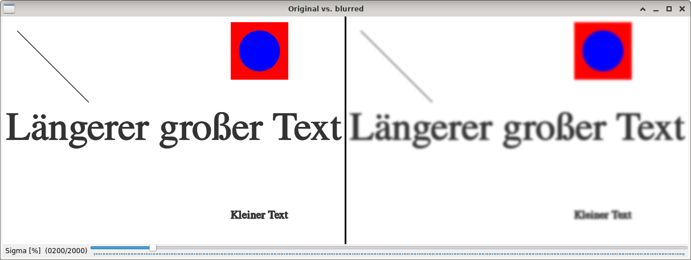
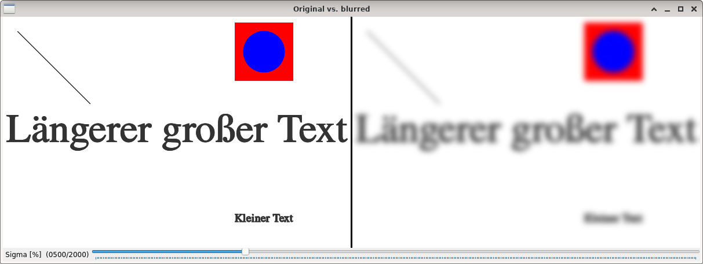

Gaussian filtering
==================

**Short description**: Illustration of Gaussian filtering (Illustrates the effect of sigma of a Gaussian filter)

**Author**: Andreas Unterweger

**Status**: Complete

Overview
--------

A two-dimensional Gaussian filter can be used to blur images. To do so, the original image (left in the *Original vs. blurred* window) is convolved with a normalized windowed two-dimensional Gaussian function with a standard deviation of sigma to yield the filtered image (right). Suitable window sizes can be computed automatically.

Usage
-----

Change the value of sigma (see parameters below) to see the filtered image become more blurry due to the higher standard deviation. Observe that image features with high spatial frequencies, e.g., steep edges, disappear, while features with low spatial frequencies, e.g., large single-color regions, are retained.

Available actions
-----------------

None. *Note: See below for parameters to change.*

Interactive parameters
----------------------

* **Sigma** (track bar in the *Original vs. blurred* window): Allows changing the standard deviation (in the X and Y direction) of the Gaussian filter in percent.

Program parameters
------------------

* **Input image**: File path of the image to apply the Gaussian filter to.

Hard-coded parameters
---------------------

* `min_sigma` (local to `Gaussian_data`): Minimum value of sigma allowed to be configured for the standard deviation.
* `max_sigma` (local to `Gaussian_data`): Maximum value of sigma allowed to be configured for the standard deviation.
* `default_sigma` (local to `Gaussian_data`): Initial value of standard deviation when the program is started.

Known issues
------------

None

Missing features
----------------

None

License
-------

This demonstration and its documentation (this document) are provided under the 3-Clause BSD License (see [`LICENSE`](../LICENSE) file in the parent folder for details). Please provide appropriate attribution if you use any part of this demonstration or its documentation.