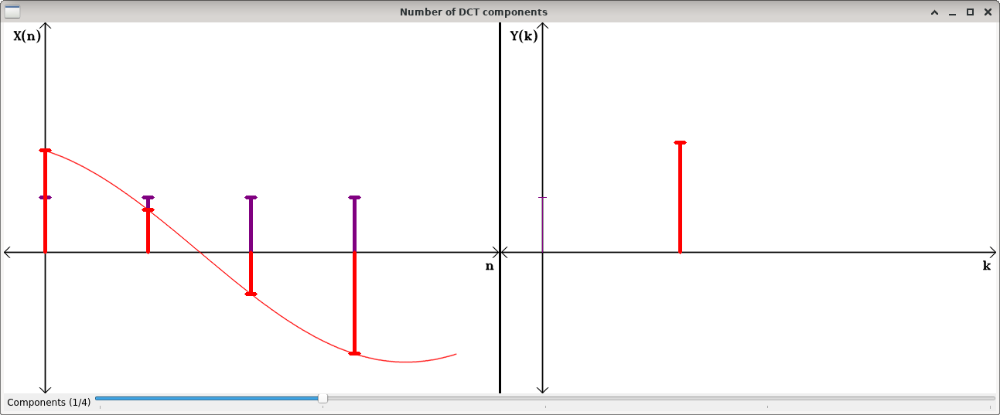

1-D DCT composition
===================

**Short description**: Illustration of the signal composition through the 1-D IDCT (Illustrates a signal's composition by its 1-D DCT components)

**Author**: Andreas Unterweger

**Status**: Complete

Overview
--------

The 1-D DCT is used to decompose discrete time-dependent signals (illustrated as a series of samples in the left part of the *Number of DCT components* window) into their frequency components. Conversely, these components can be used to reassemble the original signal. Using only a fraction of the components allows approximating the original signal. The amplitudes of the components are referred to as coefficients, which can be illustrated as series of samples in the frequency domain (right).

Usage
-----

Change the number of components (see parameters below) to be used for reassembling to see different approximations of the original signal. Observe that the first component represents the DC portion of the signal (purple on the left), while the second component represents the 0.5 Hz cosine wave portion (red). The amplitude of this wave is equal to the coefficient corresponding to 0.5 Hz (k = 1 on the right). The sum of the DC and 0.5 Hz components (left) adds up to the approximation that can be seen when increasing the number of components by one. Increasing the number of components up to the maximum, i.e., including all components, yields the original signal.

Available actions
-----------------

None

Interactive parameters
----------------------

* **Components** (track bar in the *Number of DCT components* window): Allows changing the number of DCT coefficients used to reconstruct the approximation of the original signal.

Program parameters
------------------

None

Hard-coded parameters
---------------------

* `coefficients` (local to `ShowImage`): The DCT coefficients of the signal to be reassembled. *Note: The number of DCT coefficients must be 2 or larger.*

Known issues
------------

None

Missing features
----------------

None

License
-------

This demonstration and its documentation (this document) are provided under the 3-Clause BSD License (see [`LICENSE`](../LICENSE) file in the parent folder for details). Please provide appropriate attribution if you use any part of this demonstration or its documentation.