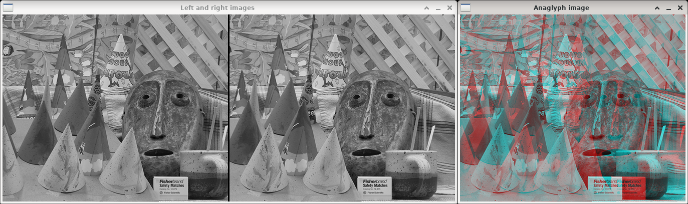

Anaglyph image
==============

**Short description**: Illustration of anaglyph images (Illustrates stereoscopy with anaglyph images)

**Author**: Andreas Unterweger

**Status**: Complete

Overview
--------

Anaglyph images can be created by coloring the left and right images of a stereoscopic image pair (window *Left and right images*) red and blue, respectively. The result is an R(G)B image (window *Anaglyph image*) which can be viewed with appropriate glasses that have red and cyan color filters for the left and right eye, respectively.

Usage
-----

The anaglyph image produces a 3-D effect when viewed with appropriate glasses. Observe that the distance of objects can be inferred without glasses from the anaglyph image due to the color differences. Objects which are close (high disparity) appear in both, red and cyan, next to one another, while object which are farther away (low disparity) only exhibit small additional red and cyan borders on each side or are all-grey due to the matching color channels.

Available actions
-----------------

None

Interactive parameters
----------------------

None

Program parameters
------------------

* **Left image**: File path of the left image of the stereoscopic image pair.
* **Right image**: File path of the right image of the stereoscopic image pair.

Hard-coded parameters
---------------------

None

Known issues
------------

None

Missing features
----------------

None

License
-------

This demonstration and its documentation (this document) are provided under the 3-Clause BSD License (see [`LICENSE`](../LICENSE) file in the parent folder for details). Please provide appropriate attribution if you use any part of this demonstration or its documentation.