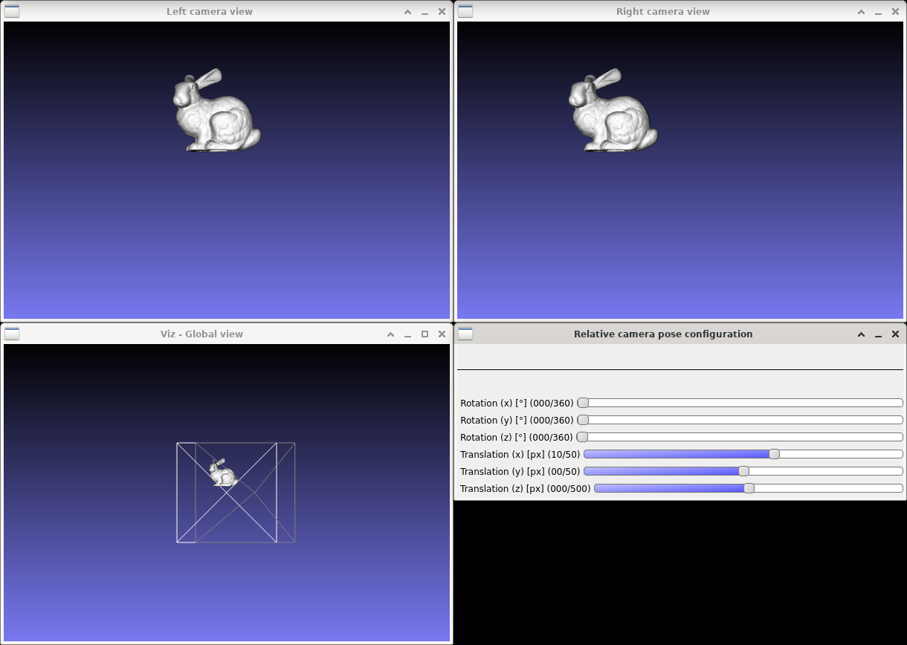
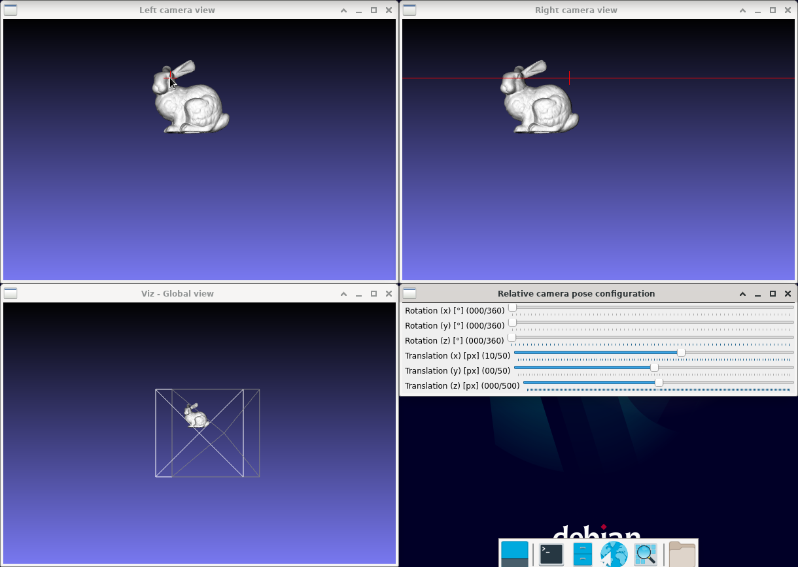

Epipolar lines
==============

**Short description**: Illustration of epipolar lines (Illustrates the epipolar lines between two pinhole camera images)

**Author**: Andreas Unterweger

**Status**: Work in progress (known issues and features missing)

Overview
--------

Capturing an image of a 3-D object with two pinhole cameras (window *Global view*) produces two images (windows *Left view* and *Right view*). For a known point in the left image, the corresponding point in the right image can be found along the so-called epipolar line under certain conditions. The location and slope of the epipolar line depend on the position of the point in the left image as well as on the relative position and pose of the two cameras with respect to each other.

*Note: The pyramids in the *Global view* window visualize the field of view of the cameras capturing the left (white) and right (grey) images, respectively.*

Usage
-----

Change the known point (red cross) in the left image (see parameters below) to see the position of the epipolar line (red line in the right image) change. Observe that, if the points are visible in both images, like the eye of the bunny for the default program parameters, the corresponding point lies on the epipolar line and is typically not in the same position as the point in the other image (visualized by another red cross).

Available actions
-----------------

None. *Note: See below for parameters to change.*

Interactive parameters
----------------------

* **Known point** (mouse over in the *Left view* window): Allows setting the known point in the left image for which the epipolar line in the right image is visualized.

*Note: Additionally, the camera position and zoom in the *Global view* window can be changed using the mouse.*

Program parameters
------------------

* **3-D model**: File path of the PLY model to capture images of.

Hard-coded parameters
---------------------

* `window_width` (local to `struct epipolar_data`): Horizontal size of all windows in pixels.
* `window_height` (local to `struct epipolar_data`): Vertical size of all windows in pixels.
* `camera_x_rotation_angle` (local to `GetStereoCameraRotationAndTranslation`): Rotation of the second camera compared to the first around the X axis in degrees (only use when no other rotations or translations are used, see known issues below).
* `camera_y_rotation_angle` (local to `GetStereoCameraRotationAndTranslation`): Rotation of the second camera compared to the first around the Y axis in degrees (only use when no other rotations or translations are used, see known issues below).
* `camera_z_rotation_angle` (local to `GetStereoCameraRotationAndTranslation`): Rotation of the second camera compared to the first around the Z axis in degrees (do not use for now -- it gives an essential matrix of zero if it is not used in combination with other rotations or translations, which is not working, see known issues below).
* `camera_x_translation_offset` (local to `GetStereoCameraRotationAndTranslation`): Horizontal distance between the two cameras in relative coordinates.
* `camera_y_translation_offset` (local to `GetStereoCameraRotationAndTranslation`): Vertical distance between the two cameras in relative coordinates (commented out, only use when no other translations or rotations are used, see known issues below).
* `camera_z_translation_offset` (local to `GetStereoCameraRotationAndTranslation`): (Depth) Distance between the two cameras in relative coordinates (commented out, only use when no other translations or rotations are used, see known issues below).

Known issues
------------

* **Incorrect epipolar lines for combined rotation/translations**: Rotations and translations around multiple axes at once as well as combinations of rotations and translations yield incorrect epipolar lines. Thus, all but one translation parameter are currently commented out.
* **Incorrect field of view of right camera**: The illustrated field of view of the right camera is not correct. The error is relatively small for the default values, but significantly larger for higher offsets.

Missing features
----------------

* **Make rotation and translation parameters interactive**: The rotation and translation parameters are currently hard-coded. Controls for interactive changes to these parameters must be added.

License
-------

This demonstration and its documentation (this document) are provided under the 3-Clause BSD License (see [`LICENSE`](../LICENSE) file in the parent folder for details). Please provide appropriate attribution if you use any part of this demonstration or its documentation.