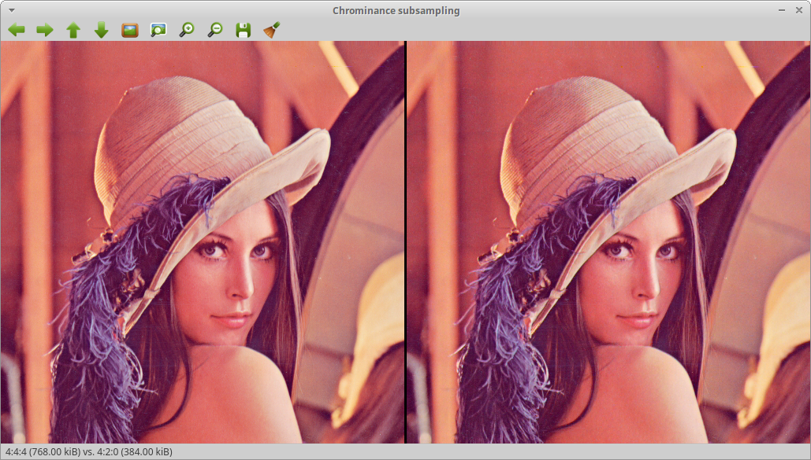
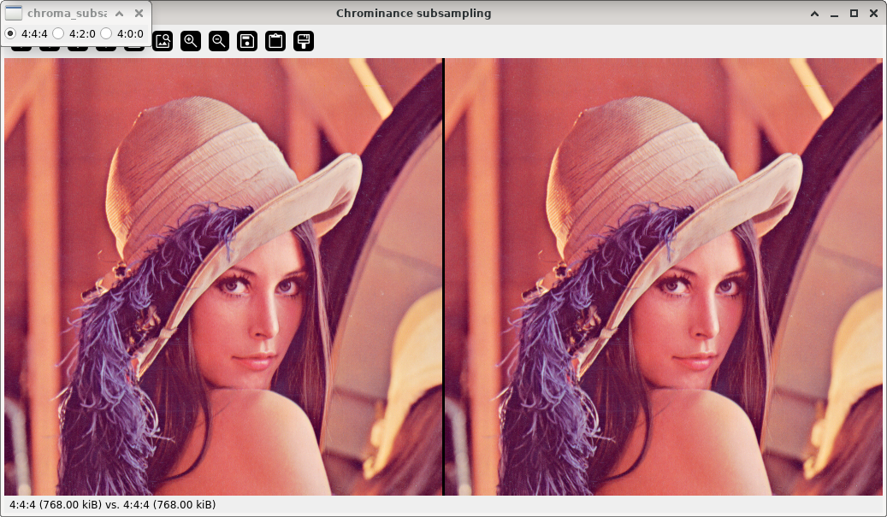

Chrominance subsampling
=======================

**Short description**: Illustration of chrominance subsampling (Illustrates the effect of chrominance subsampling)

**Author**: Andreas Unterweger

**Status**: Near-complete (nice-to-have features missing)

Overview
--------

Human visual perception is less sensitive to differences in color than it is to differences in brightness. Thus, the chrominance channels of an image (left in the *Chrominance subsampling* window) can be subsampled (right) without it being apparent to a human observer. The luminance channel remains untouched.

Usage
-----

Change the subsampling (see parameters below) to see changes to the output image. Omitting all chrominance information (4:0:0 subsampling) is clearly distinguishable from the original image, while other forms of subsampling are not, unless magnified signficantly, e.g. around strong borders between different colors. Observe that different subsamplings yield different storage sizes compared to the original image. This allows for saving storage space at practically no perceptual loss in quality.

*Note: Since the conversion between RGB and YCbCr and back is only lossless up to rounding errors, single pixel value differences are possible even for 4:4:4 subsampling.*

Available actions
-----------------

None. *Note: See below for parameters to change.*

Interactive parameters
----------------------

* **Subsampling** (radio buttons): Allows switching between 4:4:4 (no subsampling), 4:2:0 (1-in-4 chrominance subsampling) and 4:0:0 subsampling (no chrominance channels).

Program parameters
------------------

* **Input image**: File path of the image to subsample.

Hard-coded parameters
---------------------

None

Known issues
------------

None

Missing features
----------------

* **4:2:2 subsampling**: There is no option to illustrate the effect of 4:2:2 subsampling. If *OpenCV* adds 4:2:2 subsampling (see [*OpenCV* issue #9587](https://github.com/opencv/opencv/issues/9587)), this demonstration can be supplemented accordingly.

Lincense
--------

This demonstration and its documentation (this document) are provided under the 3-Clause BSD License (see [`LICENSE`](../LICENSE) file in the parent folder for details). Please provide appropriate attribution if you use any part of this demonstration or its documentation.