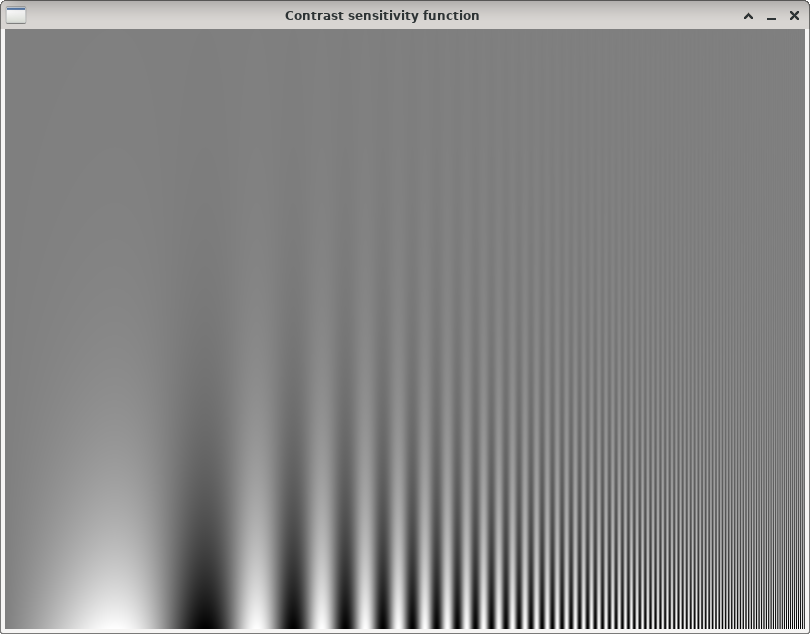

Contrast sensitivity function
=============================

**Short description**: Illustration of the contrast sensitivity function (Illustrates the contrast sensitivity function)

**Author**: Andreas Unterweger

**Status**: Near-complete (nice-to-have features missing)

Overview
--------

The perception of contrast, i.e., the difference between the darkest and brightest values, depends on the spatial frequency. The frequency-dependent perceptual contrast limit varies from human to human and is referred to as the contrast sensitivity function. An individual's contrast sensitivity function can be visualized through a sinusodial pattern with increasing frequency and contrast (window *Contrast sensitivity function*).

Usage
-----

Observe that areas of low contrast (top) for very low (top left) and very high spatial frequencies appear entirely grey. The border between the grey areas and the visible sinusodial pattern is the contrast sensitivity function.

Available actions
-----------------

None

Interactive parameters
----------------------

None

Program parameters
------------------

None

Hard-coded parameters
---------------------

* `width` (local to `GenerateCSFImage`): Horizontal window size in pixels.
* `height` (local to `GenerateCSFImage`): Vertical window size in pixels.
* `max_brightness` (local to `GenerateCSFImage`): Brighest value displayed in the sinusodial pattern. The default is 255 (maximum possible 8-bit value).

Known issues
------------

None

Missing features
----------------

* **Correct maximum spatial frequency**: The Shannon limit for a signal with an exponentially increasing frequency is not trivial to determine. The maximum frequency must be below the Shannon limit to avoid aliasing patterns in the right part of the picture.

Lincense
--------

This demonstration and its documentation (this document) are provided under the 3-Clause BSD License (see [`LICENSE`](../LICENSE) file in the parent folder for details). Please provide appropriate attribution if you use any part of this demonstration or its documentation.