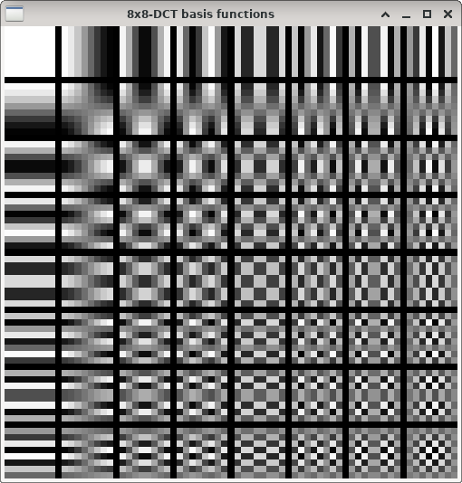

2-D DCT basis functions
=======================

**Short description**: Illustration of 2-D DCT basis functions (Illustrates the basis functions of the 2-D-DCT)

**Author**: Andreas Unterweger

**Status**: Complete

Overview
--------

The DCT is applied to blocks of image data (pixels) for various applications like compression. The two-dimensional basis functions (window *8x8-DCT basis functions*) depend on the block size and represent the components into which the 2-D pixel data is decomposed.

Usage
-----

Observe that the spatial frequency of the basis functions increases in both, the horizontal and vertical direction. The horizontal and vertical spatial frequencies are independent of one another. For the DC component (top-left-most basis function), the spatial frequency is 0.

Available actions
-----------------

None. *Note: See below for program parameters to change.*

Interactive parameters
----------------------

None

Program parameters
------------------

* **Block size** (optional, default 8): The transform size of the block in pixels. This value is identical to the number of basis functions in each direction (horizontal and vertical).

Hard-coded parameters
---------------------

* `window_size` (local to `ShowBasisFunctions`): Width and height of the window in pixels.

Known issues
------------

None

Missing features
----------------

None

License
-------

This demonstration and its documentation (this document) are provided under the 3-Clause BSD License (see [`LICENSE`](../LICENSE) file in the parent folder for details). Please provide appropriate attribution if you use any part of this demonstration or its documentation.