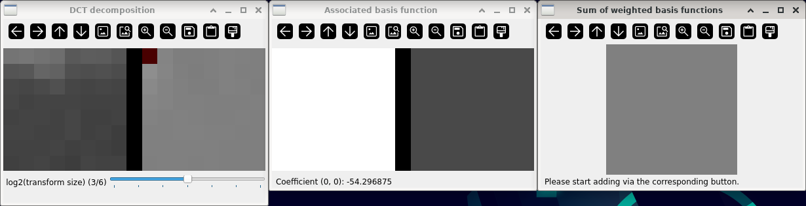
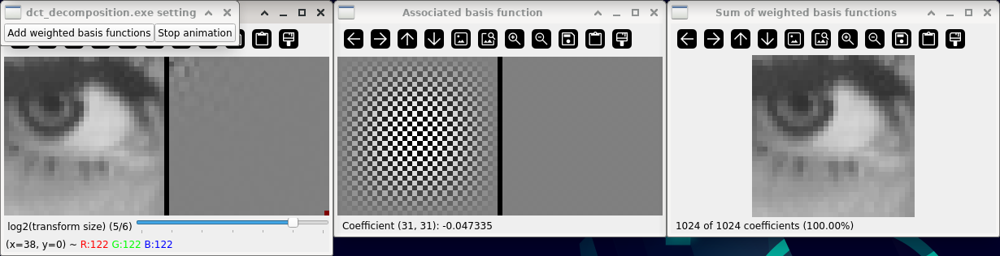

2-D DCT decomposition
=====================

**Short description**: Illustration of the decomposition of a block into 2-D DCT basis functions and their recomposition (Illustrates the DCT components of a block and their reassembly)

**Author**: Andreas Unterweger

**Status**: Complete

Overview
--------

Blocks of pixel data (left in the *DCT decomposition* window) can be transformed using the 2-D DCT to yield a block of coefficients (right). Each coefficient (red) corresponds to a basis function (left in the *Associated basis function* window). Multiplying the basis function by its coefficient (contrast value) yields a weighted basis function (right). Adding a subset of all weighted basis functions allows reconstructing an approximation of the original block (window *Sum of weighted basis functions*).

Usage
-----

Change the selected coefficient (see parameters below) to see its weight and associated basis function. Start the automatic recomposition process (see actions below) to see approximations of the original block with an increasing number of weighted basis functions. Observe that a small number of basis functions is sufficient to provide a recognizable approximation.

Available actions
-----------------

* **Add weighted basis functions** (button): Iterates through all coefficients in zig-zag order and visualizes both, the corresponding basis function as well as the sum of all weighted basis functions up to the current coefficient. *Note: Starting always restarts the process from the first coefficient.*
* **Stop animation** (button): Halts the process initiated by *Add weighted basis functions* without resetting the currently selected coefficient. *Note: Stopping after completion or when the process has not been started yet does not do anything.*

Interactive parameters
----------------------

* **Coefficient** (left mouse click in the *DCT decomposition* window): Allows selecting a coefficient whose associated basis function and weight are displayed. *Note: Selecting invalid positions (outside of the visualized coefficients) does not do anything.*

Program parameters
------------------

* **Input image**: File path of the image to decompose. *Note: Only the center region of the image is used for decomposition.*

Hard-coded parameters
---------------------

* `log_max_block_size` (local to `DCT_data`): Base-2 logarithm of the maximum x and y dimension of the block to decompose. For example, the default value of 6 limits the block size to 2^6=64 pixels.
* `log_default_block_size` (local to `DCT_data`): Base-2 logarithm of the default x and y dimension of the block to decompose. For example, the default value of 3 corresponds to a block size of 2^3=8 pixels. *Note: The default block size must be smaller than or equal to the maximum block size.*
* `displayed_window_dimension` (local to `DCT_data`): Width and height of each displayed window.
* `step_delay` (local to `DCT_data::AddWeightedBasisFunctions`): Delay in milliseconds between the first and second step of the recomposition animation. The delays between the remaining steps decrease with each step, but depend on the initial delay.

Known issues
------------

None

Missing features
----------------

None

License
-------

This demonstration and its documentation (this document) are provided under the 3-Clause BSD License (see [`LICENSE`](../LICENSE) file in the parent folder for details). Please provide appropriate attribution if you use any part of this demonstration or its documentation.