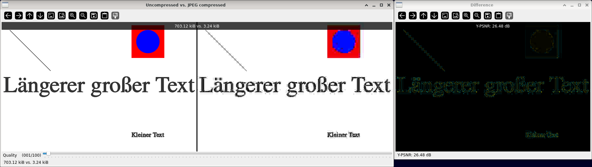

JPEG quality
============

**Short description**: Illustration of JPEG quality levels (Illustrates JPEG compression at different quality levels)

**Author**: Andreas Unterweger

**Status**: Near-complete (non-crucial bugs unfixed)

Overview
--------

JPEG compression decreases the storage requirements for images at the expense of a number of artifacts due to quantization (window *Uncompressed vs. JPEG compressed*). The strength of the quantization, i.e., the frequency-dependent quantization step sizes, can be derived from a single quality parameter for convenience. The deviation of the compressed image (right) from the original image (left) can be visualized through a difference image (window *Difference*) and expressed by the PSNR value of the Y (luminance) channel.

*Note on residual visualizations: Yellow pixels indicate positive differences, teal pixels indicate negative differences. The brighter the color is, the larger the differences are in absolute terms. Black equals zero, i.e., no difference.*

Usage
-----

Change the quality parameter (see parameters below) to see the storage size as well as the visibility and severity of the artifacts change. Observe that the differences between the input image and the compressed image are clearly visible for low quality values and yield low Y-PSNR values.

Available actions
-----------------

None. *Note: See below for parameters to change.*

Interactive parameters
----------------------

* **Quality** (track bar in the *Uncompressed vs. JPEG compressed* window): Allows changing the JPEG quality parameter used for compression in percent.

Program parameters
------------------

* **Input image**: File path of the image to compress.

Hard-coded parameters
---------------------

None

Known issues
------------

* **Window positioning**: The *Difference* window is positioned on the right, exceeding the maximum specified screen size for the default (test) image. It would better to position the *Difference* window under or above the compressed image.

Missing features
----------------

None

License
-------

This demonstration and its documentation (this document) are provided under the 3-Clause BSD License (see [`LICENSE`](../LICENSE) file in the parent folder for details). Please provide appropriate attribution if you use any part of this demonstration or its documentation.