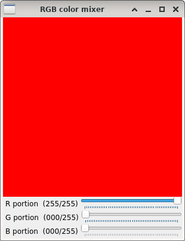
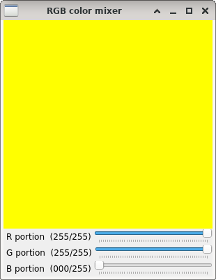

RGB mixer
=========

**Short description**: Illustration of RGB color mixing (Illustrates how RGB portions can be mixed into different colors)

**Author**: Andreas Unterweger

**Status**: Complete

Overview
--------

Human color perception is based on the three primary colors red, green and blue. Practically any color (window *RGB color mixer*) can be mixed by adding these three components with corresponding per-component intensities. The set of all colors that can be produced through mixing is referred to as the RGB color space. *Note: The choice of the primary colors determines which colors can be mixed in the first place. Thus, not all visible colors can be mixed and displayed.*

Usage
-----

Change the portions of the components (see parameters below) to see the mixed color change. Observe that setting all but one component to zero yields a shade of the respective primary color, whereas setting R, G and B equal yields a shade of grey.

Available actions
-----------------

None. *Note: See below for parameters to change.*

Interactive parameters
----------------------

* **R portion** (track bar in the *RGB color mixer* window): Allows changing the intensity of the red component between none (0) and the maximum for 8-bit channels (255).
* **G portion** (track bar in the *RGB color mixer* window): Allows changing the intensity of the green component between none (0) and the maximum for 8-bit channels (255).
* **B portion** (track bar in the *RGB color mixer* window): Allows changing the intensity of the blue component between none (0) and the maximum for 8-bit channels (255).

Program parameters
------------------

None

Hard-coded parameters
---------------------

* `image_dimension` (local to `RGB_data::GenerateColorImage`): Width and height of the displayed color (image) in pixels.

Known issues
------------

None

Missing features
----------------

None

License
-------

This demonstration and its documentation (this document) are provided under the 3-Clause BSD License (see [`LICENSE`](../LICENSE) file in the parent folder for details). Please provide appropriate attribution if you use any part of this demonstration or its documentation.