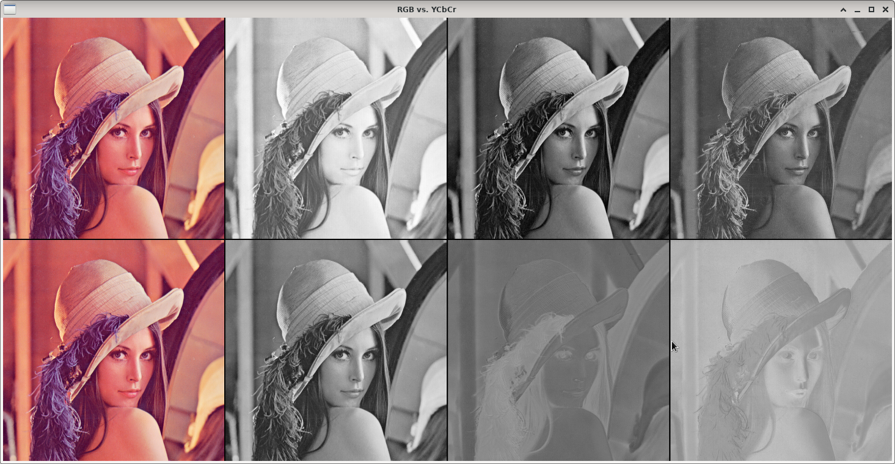

RGB vs. YCbCr decomposition
===========================

**Short description**: Illustration of RGB and YCbCr component decomposition (Extracts the RGB and YCbCr channels of an image and displays them)

**Author**: Andreas Unterweger

**Status**: Work in progress (internal bugs unfixed and nice-to-have features missing)

Overview
--------

A color image (left-most part of the *RGB vs. YCbCr* window) can be split into its R, G and B planes (top), i.e., each pixel can be broken down into its red, green and blue components. The image can also be split into its Y, Cb, Cr and planes (bottom) after converting it from the RGB color space to the YCbCr color space.

Usage
-----

Observe that the RGB channels correlate strongly and exhibit relatively high intensities, while the Cb and Cr channels do not correlate strongly with the Y channel and contain relatively low intensities. These properties make the YCbCr channels of most images more suitable for compression algorithms than the RGB channels.

Available actions
-----------------

None

Interactive parameters
----------------------

None

Program parameters
------------------

* **Input image**: File path of the image to decompose.

Hard-coded parameters
---------------------

None

Known issues
------------

* **Additional resizing**: Due to the high number of channels, the width of the displayed window would be very large. The output is resized so that the window fits the screen, but this introduces undesirable small artifacts.

Missing features
----------------

* **Subsampling**: The YCbCr components are not subsampled. There is no option to choose between different subsamplings.

License
-------

This demonstration and its documentation (this document) are provided under the 3-Clause BSD License (see [`LICENSE`](../LICENSE) file in the parent folder for details). Please provide appropriate attribution if you use any part of this demonstration or its documentation.