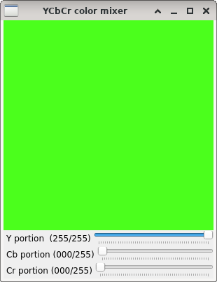

YCbCr mixer
===========

**Short description**: Illustration of YCbCr color mixing (Illustrates how YCbCr portions can be mixed into different colors)

**Author**: Andreas Unterweger

**Status**: Near-complete (nice-to-have features missing)

Overview
--------

The YCbCr color space separates the luminance (Y channel) from the chrominance information (Cb and Cr channels). Since the Y, Cb and Cr intensities of a color (window *YCbCr color mixer*) can be converted into the corresponding R, G and B intensities, the corresponding RGB color can be mixed from the Y, Cb and Cr intensities. Due to the convertibility, the YCbCr color space can represent all colors of the RGB color space.

Usage
-----

Change the portions of the components (see parameters below) to see the mixed color change. Observe that varying Y only changes the luminance, while varying Cb or Cr only changes the chrominance.

Available actions
-----------------

None. *Note: See below for parameters to change.*

Interactive parameters
----------------------

* **Y portion** (track bar in the *YCbCr color mixer* window): Allows changing the intensity of the luminance component between none (0) and the maximum for 8-bit channels (255).
* **Cb portion** (track bar in the *YCbCr color mixer* window): Allows changing the intensity of the Cb (difference to green) component between none (0) and the maximum for 8-bit channels (255).
* **Cr portion** (track bar in the *YCbCr color mixer* window): Allows changing the intensity of the Cr (difference to red( component between none (0) and the maximum for 8-bit channels (255).

Program parameters
------------------

None

Hard-coded parameters
---------------------

* `image_dimension` (local to `YCbCr_data::GenerateColorImage`): Width and height of the displayed color (image) in pixels.

Known issues
------------

None. *Note: Theoretically, Cb and Cr can be both, positive and negative. However, in all practically relevant applications, they are offset so that they are only positive. This convention is relied upon in this demonstration.*

Missing features
----------------

* **Range validation**: Not all combinations of Y, Cb and Cr intensities yield valid RGB values. Even though all practically relevant applications clip the result of YCbCr-to-RGB conversions in the way that this demonstration does, there is no indicator for the validity of the intensity values.

License
-------

This demonstration and its documentation (this document) are provided under the 3-Clause BSD License (see [`LICENSE`](../LICENSE) file in the parent folder for details). Please provide appropriate attribution if you use any part of this demonstration or its documentation.