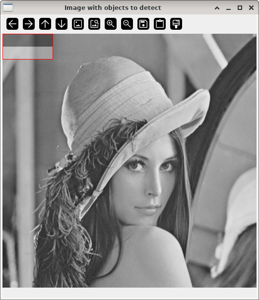
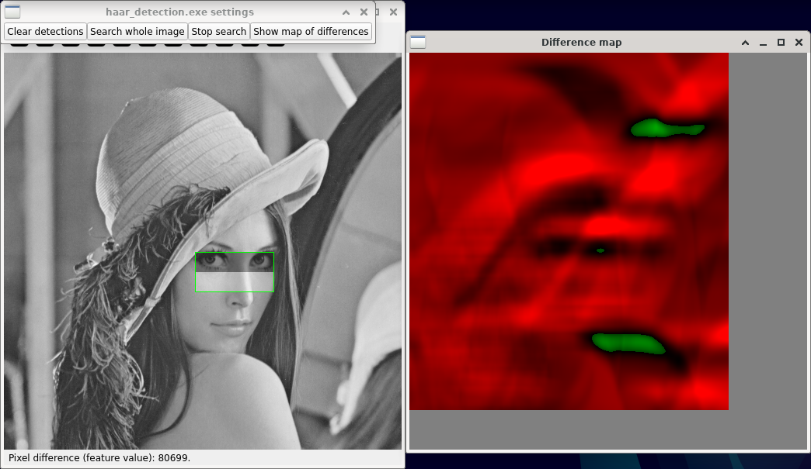

Haar-feature-based detection
============================

**Short description**: Illustration of Haar features for object detection (Illustrates object detection with Haar features)

**Author**: Andreas Unterweger

**Status**: Complete

Overview
--------

In order to detect basic objects in an image (window *Image with objects to detect*), e.g., shapes similar to a pair of eyes, Haar-like features (overlaid black-white pattern inside the red rectangle) can be used. Inside a rectangular region, referred to as window, the sum of all pixels in the black area is subtracted from the sum of all pixels in the white area. A window is considered containing an object if the feature value is above a pre-defined threshold. If the threshold is set adequately, this allows successfully detecting the position of all objects with a small number of false negatives.

Usage
-----

Change the window position (see parameters below) to see the different resulting feature values. Start the automatic search process (see actions below) to see all positions where objects can be found, i.e., the ones where the feature value of the window exceeds the pre-defined threshold (highlighted in green). For the default program parameters, observe that the region around the eyes contains several successful detections, while few other regions exhibit detections which do not contain pairs of eyes. The map of differences (see actions below) highlights allows for distinguishing these areas by color.

Available actions
-----------------

* **Clear detections** (button): Removes all successful detections (green windows) found so far.
* **Search whole image** (button): Iterates through all valid window positions and highlights all detections in the process. *Note: Starting always restarts the process from the top-left-most position.*
* **Stop search** (button): Halts the process initiated by *Search whole image* without removing the successful detections. *Note: Stopping after completion or when the process has not been started yet does not do anything.*
* **Show map of differences**: Iterates through all valid window positions at once, i.e., without intermediate visualizations, and shows a map of differences after finishing. Green pixels indicate window positions which are successful detections, while red pixels indicate the opposite. The stronger the color is, the further away the computed difference is from the pre-defined threshold. Clicking on pixels in the map sets the window position in the main window (see interactive parameters below). *Note: Computing the map might take some time initially.*

Interactive parameters
----------------------

* **Window position** (left mouse click in the *Image with objects to detect* window): Allows setting the window position in the input frame (left). Positions which contain a detected object are highlighted in green, while all others are highlighted in red. *Notes: Successfully detected windows positions stay highlighted once selected, unless they are cleared (see actions above). Clicking specifies the position of the top-left corner of the window. Selecting invalid positions (those yielding to any block pixel being outside of the image) does not do anything.*

Program parameters
------------------

* **Input image**: File path of the image to detect objects in.

Hard-coded parameters
---------------------

* `block_width`: Horizontal size of the search window in pixels. *Note: The block width must be even.*
* `block_height`: Vertical size of the search window in pixels. *Note: The block height must be even.*
* `detection_threshold`: Threshold above which the feature value (difference of pixel sums) is considered a positive, i.e., above which a detection is reported.
* `border_size`: Width of the borders highlighting the selected window as well as successful detections. *Note: Larger values might make it difficult to see where the inner and outer parts of a highlighted window are exactly.*
* `overlay_alpha` (local to `GetAnnotatedImage`): Alpha value for the feature overlay in the selected window. 0 means that the feature is not shown and that only the image content is visible, while 1 means that only the feature is shown and that that the image content is not visible. Values between 0 and 1 blend the feature and the image with the specified intensity (alpha value) and its additive inverse (1 minus `overlay_alpha`), respectively.

Known issues
------------

None

Missing features
----------------

None

License
-------

This demonstration and its documentation (this document) are provided under the 3-Clause BSD License (see [`LICENSE`](../LICENSE) file in the parent folder for details). Please provide appropriate attribution if you use any part of this demonstration or its documentation.
