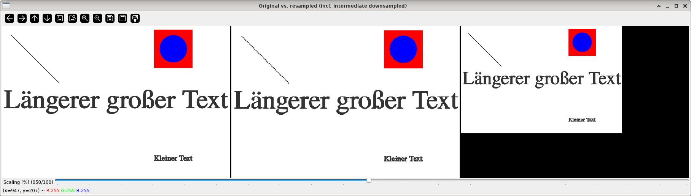
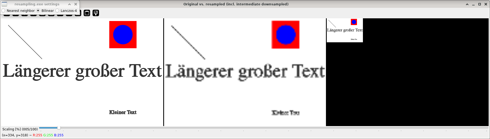

Image resampling
================

**Short description**: Illustration of downsampling and upsampling (Illustrates the effect of resampling)

**Author**: Andreas Unterweger

**Status**: Near-complete (non-crucial bugs unfixed)

Overview
--------

Resizing an image (left in the *Original vs. resampled (incl. intermediate downsampled)* window) requires resampling it. Reducing the image size is equivalent to downsampling with interpolation (right). Increasing the size is equivalent to upsampling with interpolation. The performance of different interpolation methods can be assessed by upsampling the downsampled image again to its original size and comparing this upsampled image (middle) to the original image (left).

Usage
-----

Change the interpolation method (see parameters below) to see the image fidelity and artifacts change. Observe that very small scaling factors, e.g., 5%, yield low fidelity regardless of the interpolation method due to information being lost during downsampling. However, differences between the interpolation methods are still clearly visible.

Available actions
-----------------

None. *Note: See below for parameters to change.*

Interactive parameters
----------------------

* **Interpolation method** (radio buttons): Allows switching between different interpolation methods (nearest-neighbor interpolation, bilinear interpolation and Lanczos interpolation with four neighbors in each direction). The selected interpolation method is used for both, upsampling and downsampling.
* **Scaling** (track bar in the *Original vs. resampled (incl. intermediate downsampled)* window): Allows changing the size of the downscaled image relative to the original size in percent.

Program parameters
------------------

* **Input image**: File path of the image to resample.

Hard-coded parameters
---------------------

None

Known issues
------------

* **Window too large**: The window is slightly wider than 1050 pixels for the default input image. *Note: Using a smaller image or higher screen resolutions works around this issue.*

Missing features
----------------

None

License
-------

This demonstration and its documentation (this document) are provided under the 3-Clause BSD License (see [`LICENSE`](../LICENSE) file in the parent folder for details). Please provide appropriate attribution if you use any part of this demonstration or its documentation.