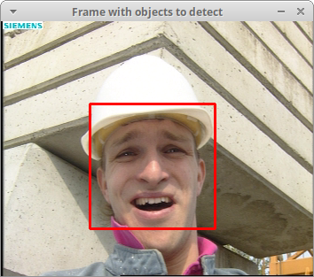
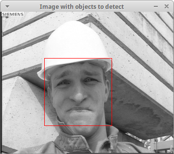

Object detection by Viola & Jones
=================================

**Short description**: Illustration of Viola-Jones object detection (Illustrates object detection on video frames with the object detector by Viola and Jones)

**Author**: Andreas Unterweger

**Status**: Complete

Overview
--------

The object detection algorithm by Viola and Jones can be used to find the position (red rectangle) of faces in an image (window *Image with objects to detect*), given an appropriately trained classifier cascade. This concept can be extended to detect faces in videos, i.e., sequences of images, when one frame is processed after another.

Usage
-----

Advance to the next frame (see parameters below) to its face detection results. For the default program parameters, observe that the detection is successful and relatively consistent among all frames.

Available actions
-----------------

Press Q to quit. Use any other key to advance to the next frame. *Notes: Pressing any key in the last frame terminates the program.*

Interactive parameters
----------------------

None

Program parameters
------------------

* **Input video**: File path of the video to detect objects in. If *-* is specified, a webcam is used. *Note: An image or image sequence can also be specified instead of a video file.*

Hard-coded parameters
---------------------

* `classifier_path` (local to `InitClassifier`): File path of the XML file specifying the classifier cascade to be used.

Known issues
------------

None

Missing features
----------------

None

License
-------

This demonstration and its documentation (this document) are provided under the 3-Clause BSD License (see [`LICENSE`](../LICENSE) file in the parent folder for details). Please provide appropriate attribution if you use any part of this demonstration or its documentation.
