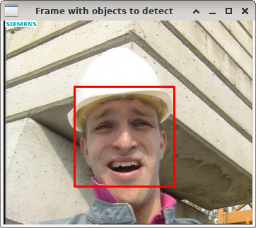

Object detection by Viola & Jones
=================================

**Short description**: Illustration of Viola-Jones object detection (Illustrates object detection on multiple input frames with the object detector by Viola and Jones)

**Author**: Andreas Unterweger

**Status**: Complete

Overview
--------

The object detection algorithm by Viola and Jones can be used to find the position (red rectangle) of faces in an image (window *Image with objects to detect*), given an appropriately trained classifier cascade. This concept can be extended to detect faces in videos, i.e., sequences of images, when one frame is processed after another.

Usage
-----

Advance to the next frame (see parameters below) to its face detection results. For the default program parameters, observe that the detection is successful and relatively consistent among all frames.

Available actions
-----------------

Use any key to advance to the next frame. *Notes: Pressing any key in the last frame terminates the program. For all other frames, the program cannot be terminated by pressing a key.*

Interactive parameters
----------------------

None

Program parameters
------------------

* **Input images** (one image per parameter): File path of the frames to detect objects in. *Note: At least one parameter (image) must be specified.*

Hard-coded parameters
---------------------

* `classifier_path` (local to `InitClassifier`): File path of the XML file specifying the classifier cascade to be used.

Known issues
------------

None

Missing features
----------------

None

License
-------

This demonstration and its documentation (this document) are provided under the 3-Clause BSD License (see [`LICENSE`](../LICENSE) file in the parent folder for details). Please provide appropriate attribution if you use any part of this demonstration or its documentation.