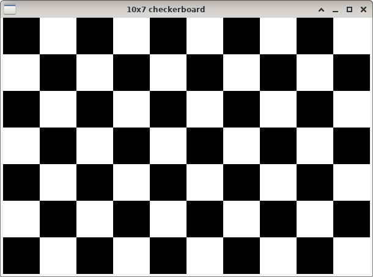

2-D checkerboard calibration pattern
====================================

**Short description**: Illustration of a checkerboard pattern for calibration (Illustrates an asymmetrical checkerboard pattern for camera calibration)

**Author**: Andreas Unterweger

**Status**: Complete

Overview
--------

Camera calibration requires an object with known geometry. Checkerboard patterns (window *10x7 checkerboard*) can be used as two-dimensional [camera calibration patterns](https://docs.opencv.org/3.4.0/d4/d94/tutorial_camera_calibration.html).

Usage
-----

Observe that the checkerboard is asymmetric, i.e., the number of rows is different from the number of columns and the top and bottom fields on the left and right have different colors. This allows distinguishing rotations of the pattern without ambiguity.

Available actions
-----------------

None

Interactive parameters
----------------------

None

Program parameters
------------------

None

Hard-coded parameters
---------------------

* `checkerboard_width` (local to `ShowCheckerboard`): Number of horizontal checkerboard fields.
* `checkerboard_height` (local to `ShowCheckerboard`): Number of vertical checkerboard fields.
* `field_size` (local to `GenerateCheckerboardPattern`): Horizontal and vertical size of each checkerboard field in pixels.

Known issues
------------

None

Missing features
----------------

None

License
-------

This demonstration and its documentation (this document) are provided under the 3-Clause BSD License (see [`LICENSE`](../LICENSE) file in the parent folder for details). Please provide appropriate attribution if you use any part of this demonstration or its documentation.