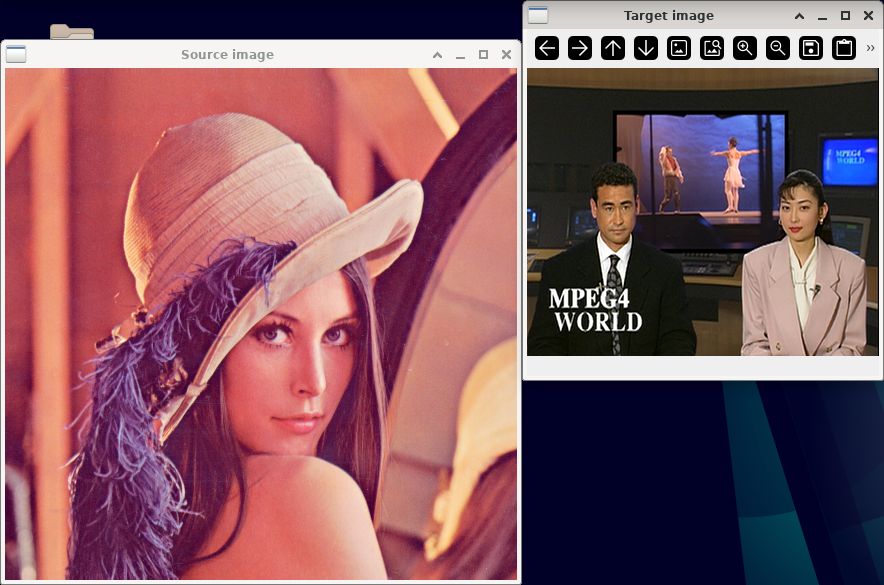
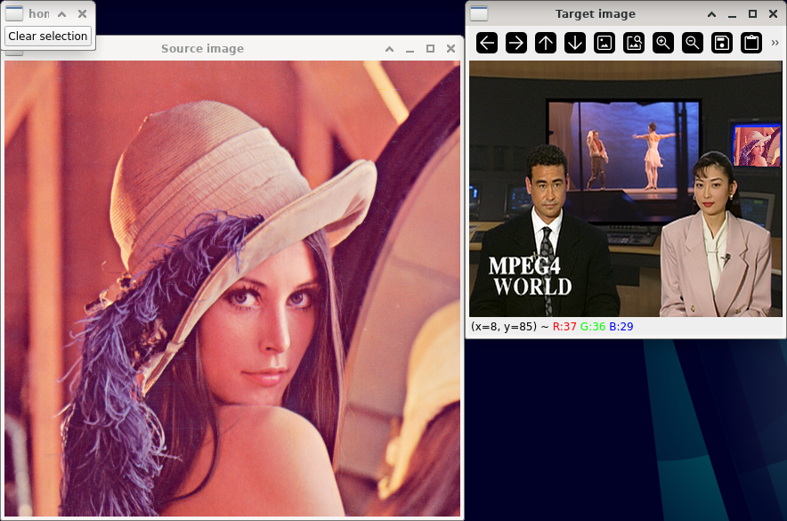

Homography
==========

**Short description**: Illustration of plane-to-plane warping with a homography (Illustrates the warp in perspective from one plane to another)

**Author**: Andreas Unterweger

**Status**: Work in progress (features missing)

Overview
--------

Homographies allow mapping 2-D surfaces to 2-D surfaces. They can be used to warp an image (window *Source image*) into a quadrangular region in another image (window *Target image*). This can be used for overlays.

Usage
-----

Set the corner points (see parameters below) to see the warped image within the defined quadrangle. Observe that the selected region is overlaid with the warped image fittingly if both contain approximately two-dimensional conent.

Available actions
-----------------

* **Clear selection** (button): Deletes all previously specified corner points of the quadrangle and removes the warped image from the *Target image* window, if it has been warped.

Interactive parameters
----------------------

* **Corner points** (left mouse click in the *Target image* window): Allows setting the position of a corner point of the quadrangle to warp the source image into. A total of four corner points need to be specified in the following order: Top-left, top-right, bottom-right, bottom-left. After setting the fourth position, the image is warped into the quadrangle specified by the four corner points. *Note: Clicking after warping, i.e., after the fourth position has been specified, does not do anything.*

Program parameters
------------------

* **Source image**: File path of the image to warp.
* **Target image**: File path of the image to warp the *source image* into.

Hard-coded parameters
---------------------

None

Known issues
------------

None

Missing features
----------------

* **Intuitive point selection**: The selection of corner points is unintuitive and needs to be explained. Changing the position of single points is not possible, but requires removing all points and starting over.

License
-------

This demonstration and its documentation (this document) are provided under the 3-Clause BSD License (see [`LICENSE`](../LICENSE) file in the parent folder for details). Please provide appropriate attribution if you use any part of this demonstration or its documentation.