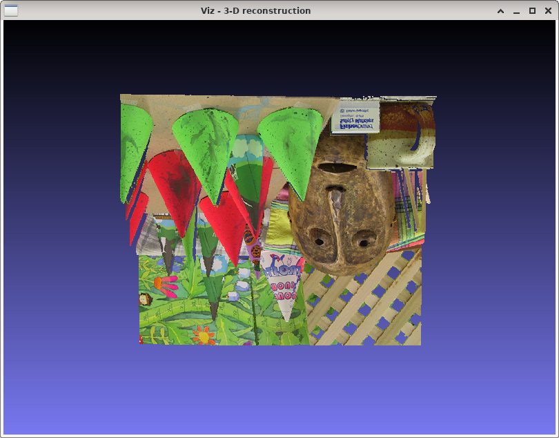

3-D reconstruction
==================

**Short description**: Illustration of 3-D reconstruction from a disparity image (Illustrates 3-D reconstruction from an image and its disparity image)

**Author**: Andreas Unterweger

**Status**: Near-complete (external bugs unfixed)

Overview
--------

A disparity image can be converted into a depth image. Using the values of the depth image as Z coordinates allows reprojecting a (2-D) image pixel by pixel to achieve a 3-D reconstruction (window *3-D reconstruction*).

Usage
-----

Zoom into the reconstruction to see the single reprojected points (pixels). Move the camera to change the perspective. Observe that near and far-away objects in the image can be clearly distinguished due to the depth information.

Available actions
-----------------

None

Interactive parameters
----------------------

None. *Note: The camera position and zoom can be changed using the mouse.*

Program parameters
------------------

* **Input image**: File path of the image to be reprojected.
* **Disparity image**: File path of the disparity image corresponding to the *input image*.

Hard-coded parameters
---------------------

None

Known issues
------------

None

Missing features
----------------

* **Correct camera orientation**: The reprojection appears upside down. It must be flipped. *Note: Code to fix this exists, but is commented as applying it disables zooming due to an *OpenCV* bug (see [*OpenCV* issue #9575](https://github.com/opencv/opencv/issues/9575)).*
* **Camera stuttering** (*OpenCV* bug): The camera stutters (and eventually shows nothing at all) when changing between parameter values (see [*OpenCV* issue #9388](https://github.com/opencv/opencv/issues/9388)).

License
-------

This demonstration and its documentation (this document) are provided under the 3-Clause BSD License (see [`LICENSE`](../LICENSE) file in the parent folder for details). Please provide appropriate attribution if you use any part of this demonstration or its documentation.
