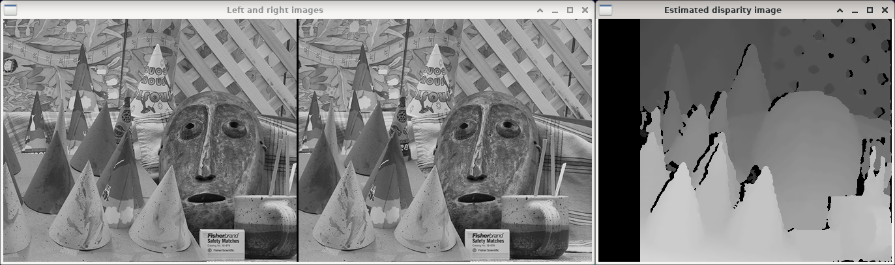

Semi-global stereo matching
===========================

**Short description**: Illustration of semi-global stereo matching (Illustrates the estimation of a disparity image via semi-global stereo matching)

**Author**: Andreas Unterweger

**Status**: Complete

Overview
--------

The difference in position of a pixel between the left and the right image of a stereoscopic image pair is referred to as disparity. A disparity image (window *Estimated disparity image*), i.e., a map of disparity values for each pixel, can be estimated from a pair of left and right images (window *Left and right images*) using the semi-global stereo matching algorithm.

Usage
-----

For the default program parameters, observe that the disparity of large objects can be estimated relatively well, while small objects and the regions between objects have either no or incorrectly estimated disparity information.

Available actions
-----------------

None

Interactive parameters
----------------------

None

Program parameters
------------------

* **Left image**: File path of the left image to be used as input for the semi-global stereo matching algorithm.
* **Right image**: File path of the right image to be used as input for the semi-global stereo matching algorithm.

Hard-coded parameters
---------------------

* `number_of_disparities`: The number of different disparity values for the semi-global stereo matching algorithm.
* `SAD_window_size` (local to `GetDisparityImage`): The window size in pixels used for calculating the quality of a match in the semi-global stereo matching algorithm.

Known issues
------------

None

Missing features
----------------

None

License
-------

This demonstration and its documentation (this document) are provided under the 3-Clause BSD License (see [`LICENSE`](../LICENSE) file in the parent folder for details). Please provide appropriate attribution if you use any part of this demonstration or its documentation.