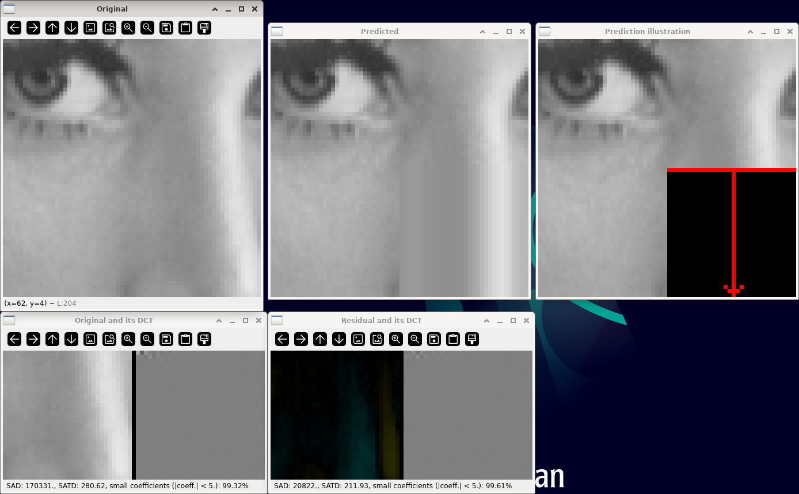

Intra prediction
================

**Short description**: Illustration of intra prediction and the effect of residuals on transforms (Illustrates intra prediction and its effect on the subsequent transform)

**Author**: Andreas Unterweger

**Status**: Near-complete (nice-to-have features missing)

Overview
--------

In order to code a block of an image, its pixels can either be transformed by themselves (window *Original and its DCT*) or as the difference to a prediction (window *Residual and its DCT*). This prediction is based on information from coded neighboring blocks (windows *Predicted* and *Prediction illustration*) and impacts the residual. The properties of the transformed residual (window *Residual and its DCT*) relevant for coding differ from the properties of the stand-alone transformed pixels (window *Original and its DCT*).

*Note on residual visualizations: Yellow pixels indicate positive differences, teal pixels indicate negative differences. The brighter the color is, the larger the differences are in absolute terms. Black equals zero, i.e., no difference.*

Usage
-----

Change the prediction method (see parameters below) to see the different performance of horizontal and vertical intra prediction, respectively. For the default program parameters, vertical prediction yields a lower sum of absolute transformed differences (SATD) and a larger number of small coefficients than horizontal prediction. Observe that the number of small coefficients is larger for the stand-alone block than it is for the residuals with any prediction method.

Available actions
-----------------

None. *Note: See below for parameters to change.*

Interactive parameters
----------------------

* **Prediction method** (radio buttons): Allows switching between horizontal intra prediction (from the bottom-left block) and vertical intra prediction (from the top-right block).

Program parameters
------------------

* **Input image**: File path of the image to perform intra prediction in. *Note: Only the center region of the image is used for prediction.*

Hard-coded parameters
---------------------

* `block_size`: x and y dimension of the block to be predicted. *Note: The displayed area consists of four blocks, i.e., its x and y dimensions are double that of `blocksize`, each.*

Known issues
------------

None

Missing features
----------------

* **Border illustration**: There is no option to illustrate the four separate blocks in the original image, e.g., by their borders.

License
-------

This demonstration and its documentation (this document) are provided under the 3-Clause BSD License (see [`LICENSE`](../LICENSE) file in the parent folder for details). Please provide appropriate attribution if you use any part of this demonstration or its documentation.