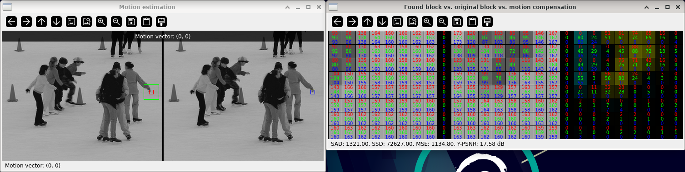
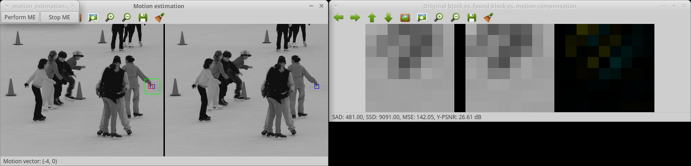

Motion estimation
=================

**Short description**: Illustration of motion estimation and motion compensation (Illustrates motion estimation and motion compensation)

**Author**: Andreas Unterweger

**Status**: Near-complete (nice-to-have features missing, non-crucial external bugs unfixed)

Overview
--------

In order to code a block (indicated by a blue rectangle in the *Motion estimation* window) of a video frame (right), coded data of another block (red rectangle) from a temporally preceding frame (left) is used as a reference for prediction. The difference between the original block and the prediction (window *Original block vs. found block vs. motion compensation*) impacts the compressibility properties of the block to be coded. The process of calculating this difference is referred to as motion compensation. Searching for the best-matching block, i.e., the one with the best compressibility properties, within a pre-defined area (green rectangle in the *Motion estimation* window) around the spatially co-located block in the reference frame is called motion estimation (ME). The offset between the location of the original block and the block found through this search is called motion vector.

*Note on residual visualizations: Yellow pixels indicate positive differences, teal pixels indicate negative differences. The brighter the color is, the larger the differences are in absolute terms. Black equals zero, i.e., no difference.*

Usage
-----

Change the motion vector (see parameters below) to see the different resulting residuals and their sum of squared differences (SSDs). Start the automatic motion estimation process (see actions below) to see all possible blocks and subsequently the best match, i.e., the one whose residual yields the smallest SSD. For the default program parameters, observe that the found block is very similar to the original block and thus the residual to be coded is very small.

Available actions
-----------------

* **Perform ME** (button): Iterates through all valid motion vectors and highlights the best match after the completed process. *Note: Starting always restarts the process from the top-left-most position.*
* **Stop ME** (button): Halts the process initiated by *Perform ME* without resetting the current motion vector position. *Note: Stopping after completion or when the process has not been started yet does not do anything.*

Interactive parameters
----------------------

* **Motion vector** (left mouse click in the *Motion estimation* window): Allows setting the block position in the reference frame (left). *Notes: Clicking specifies the position of the top-left corner of the block. Selecting invalid positions (those yielding to any block pixel being outside of the search range) does not do anything.*

Program parameters
------------------

* **Reference image**: File path of the frame to perform motion estimation in.
* **Input image**: File path of the frame containing the block to be coded, i.e., whose pixels to search for. *Note: Only a small block of the image is used for searching.*
* **Block center coordinates**: Center X and Y coordinates of the block from the input image to search.

Hard-coded parameters
---------------------

* `search_radius`: Number of pixels in each direction around the original block used for motion estimation.
* `block_size`: x and y dimension of the block used for the search.
* `border_size`: Width of the borders highlighting the blocks. *Note: Larger values might make it difficult to see where the inner and outer parts of a highlighted block are exactly.*
* `ME_step_delay` (local to `PerformMotionEstimation`): Delay in milliseconds between consecutive motion vector positions for the automatic motion estimation process.

Known issues
------------

* **Incorrect initial zoom** (*OpenCV* bug): The pixel values in the *Original block vs. found block vs. motion compensation* window are supposed to be visible at a zoom level of 30, but the zoom level is calculated incorrectly from the window size (see [*OpenCV* issue #9405](https://github.com/opencv/opencv/issues/9405)).

Missing features
----------------

* **Cost map illustration**: There is no option to illustrate the SSD values of all possible search positions in a separate window.

License
-------

This demonstration and its documentation (this document) are provided under the 3-Clause BSD License (see [`LICENSE`](../LICENSE) file in the parent folder for details). Please provide appropriate attribution if you use any part of this demonstration or its documentation.